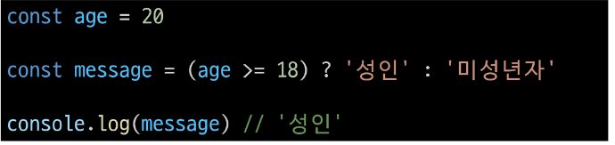
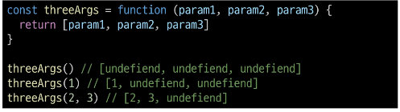

# 데이터 타입

### 원시 자료형 예시

- 변수에 할당될 때 값이 복사됨

- > 변수 간에 서로 영향을 미치지 않음

### 참조 자료형 예시

- 객체를 생성하면 객체의 메모리 주소를 변수에 할당

- > 변수 간에 서로 영향을 미침

## 원시 자료형

### 원시 자료형 종류

- Number

- String

- null

- undefined

- Boolean

### Number

- 정수 또는 실수형 숫자를 표현하는 자료형

### Number 예시

### String

- 텍스트 데이터를 표현하는 자료형

### String 예시

- '+' 연산자를 사용해 문자열끼리 결합

- 뺄셈, 곱셈, 나눗셈 불가능

### Template Literals (템플릿 리터럴)

- 내장된 표현식을 허용하는 문자열 작성 방식

- Backtick(``)을 이용하며, 여러 줄에 걸쳐 문자열을 정의할 수도 있고 JavaScript의 변수를 문자열 안에 바로 연결할 수 있음

- 표현식은 '$'와 중괄호({expression})로 표기

- ES6+ 부터 지원

### null과 undefined

### Boolean (true / false)

- > 조건문 또는 반복문에서 Boolean이 아닌 데이터 타입은 "자동 형변환 규칙"에 따라 true또는 false로 변환됨

### 자동 형변환

# 연산자

### 할당 연산자

- 오른쪽에 있는 피연산자에 할당하는 연산자

- 단축 연산자 지원

### 증가 & 감소 연산자

- 증가 연산자 ('++')
  - 피연산자를 증가(1을 더함)시키고 연산자의 위치에 따라 증가하기 전이나 후의 값을 반환

- 감소 연산자 ('--')
  - 피연산자를 감소(1을 뺌)시키고 연산자의 위치에 따라 감소하기 전이나 후의 값을 변환

- > '+='또는 '-='와 같이 더 명시적인 표현으로 작성 하는 것을 권장

### 비교 연산자

- 피연사자들(숫자, 문자, Boolean 등)을 비교하고 결과 값을 boolean으로 반환하는 연산자

### 동등 연산자 (==)

- 두 피연산자가 같은 값으로 평가되는지 비교 후 boolean 값을 반환

- '암묵적 타입 변환'통해 타입을 일치시킨 후 같은 값인지 비교

- 두 피연산자가 모두 객체일 경우 메모리의 같은 객체를 바라보는지 판별

### 일치 연산자 (===)

- 두 피연사자의 값과 타입이 모두 같은 경우 true를 반환

- 같은 객체를 가리키거나, 같은 타입이면서 같은 값인지를 비교

- 엄격한 비교가 이뤄지며 암묵적 타입 변환이 발생하지 않음

- 특수한 경우를 제외하고는 동등 연산자가 아닌 일치 연산자 사용 권장

### 논리 연산자

- and 연산
  - &&

- or 연산
  - ||

- not 연산
  - !

- 단축 평가 지원 

# 조건문

### if 

- 조건 표현식의 결과값을 boolean 타입으로 변환 후 참/거짓을 판단

### if 예시

### 삼항 연산자

- condition
  - 평가할 조건 (true 또는 false로 평가)

- expression1
  - 조건이 true일 경우 반환할 값 또는 표현식

- expression2
  - 조건이 false일 경우 반환할 값 또는 표현식

### 삼항 연산자 예시

- 간단한 조건부 로직을 간결하게 표현할 때 유용

- > 복잡한 로직이나 대다수의 경우에는 가독성이 떨어질 수 있으므로 적절한 상황에서만 사용할 것

# 반복문

### 반복문 종류

- while

- fir

- for ...in

- for ...of

### while

- 조건문이 참이면 문장을 계속해서 수행

### while 예시

### for

- 특정한 조건이 거짓으로 판별될 때까지 반복

### for 예시

### for 동작 원리

## for ...in

### for ...in

- 객체의 열거 가능한 속성(property)에 대해 반복

 

### for ...in 예시

## for ...of

### for ...of

- 반복 가능한 객체(배열, 문자열 등)에 대해 반복

### for ...of 예시

## for ...in과 for ...of

### for ...in과 for ...of 비교 (배열과 객체)

 

### 배열 반복과 for...in

- 객체 관점에서 배열의 인덱스는 "정수 이름을 가진 열거 가능한 속성"

- for...in은 정수가 아닌 이름과 속성을 포함하여 열거 가능한 모든 속성을 반환

- 내부적으로 for ...in은 배열의 반복자가 아닌 속성 열거를 사용하기 때문에 특정 순서에 따라 인덱스를 반환하는 것을 보장할 수 없음

- > for...in은 인덱스의 순서가 중요한 배열에서는 사용하지 않음

- > 배열에서는 for문, for...of를 사용

- 객체 관점에서 배열의 인덱스는 정수 이름을 가진 속성이기 때문에 인덱스가 출력됨 (순서 보장 X)

### 반복문 사용 시 const 사용 여부

- for 문
  - for (let i = 0; i < arr.length; i++) { ... }의 경우에는 최초 정의한 i를 "재할당"하면서 사용하기 때문에 const를 사용하면 에러 발생

- for...in, for...of
  - 재할당이 아니라, 매 반복마다 다른 속성 이름이 변수에 지정되는 것이므로 const를 사용해도 에러가 발생하지 않음
  - 단, const 특징에 따라 블록 내부에서 변수를 수정할 수 없음

### 반복문 종합

# 함수

## 개요

### Function

- 참조 자료형에 속하며 모든 함수는 Function object

### 데이터 타입

## 함수 정의

### 함수 구조

- function 키워드

- 함수의 이름

- 함수의 매개변수

- 함수의 body를  구성하는 statements

- return 값이 없다면 undefined를 반환

### 함수 정의 2가지 방법

- 선언식(function declaration)

- 표현식(function expression)

### 함수 선언식 특징

- 호이스팅 됨

- 코드의 구조와 가독성 면에서는 표현식에 비해 장점이 있음

### 함수 표현식 특징

- 호이스팅 되지 않음
  - 변수 선언만 호이스팅되고 함수 할당은 실행 시점에 이루어짐

- 함수 이름이 없는 '익명 함수'를 사용할 수 있음

### 함수 표현식 사용을 권장하는 이유

- 예측 가능성
  - 호이스팅의 영향을 받지 않아 코드의 실행 흐름을 더 명확하게 예측할 수 이씅ㅁ

- 유연성
  - 변수에 할당되므로 함수를 값으로 다루기 쉬움

- 스코프 관리
  - 블록 스코프를 가지는 let이나 const와 함께 사용하여 더 엄격한 스코프 관리가 가능

## 매개변수

### 매개변수 정의 방법

1. 기본 함수 매개변수

2. 나머지 매개변수

### 1. 기본 함수 매개변수 (Default function parameter)

- 전달하는 인자가 없거나 undefined가 전달될 경우 이름 붙은 매개변수를 기본값으로 초기화

### 2. 나머지 매개변수 (Rest parameter)

- 임의의 수의 인자를 '배열'로 허용하여 가변 인자를 나타내는 방법

- 작성규칙
  - 함수 정의 시 나머지 매개변수는 하나만 작성할 수 있음
  - 나머지 매개변수는 함수 정의에서 매개변수 마지막에 위치해야 함

### 매개변수와 인자 개수가 불일치 할 때

- 매개변수 개수 > 인자 개수

- > 누락된 인자는 undefined로 할당

- 매개변수 개수 < 인자 개수

- > 초과 입력한 인자는 사용하지 않음

## Spread syntax

### '...' (Spread syntax)

- 전개 구문

### 전개 구문

- 배열이나 문자열과 같이 반복 가능한 항목을 펼치는 것 (확장, 전개)

- 전개 대상에 따라 역할이 다름

- > 배열이나 객체의 요소를 개별적인 값으로 분리하거나 다른 배열이나 객체의 요소를 현재 배열이나 객체에 추가하는 등

### 전개 구문 활용처

1. 함수와의 사용
  - 1) 함수 호출 시 인자 확장
  - 2) 나머지 매개변수 (압축)

2. 객체와의 사용 (객체 파트에서 진행)

3. 배열과의 활용 (배열 파트에서 진행)

### 전개 구문 활용

- 함수와의 사용
    1. 인자 확장 (함수 호출 시)

    

    2. 나머지 매개변수 (함수 선언 시)

    

## 화살표 함수 표현식

### 화살표 함수 표현식 (Arrow function expressions)

- 함수 표현식의 간결한 표현법

### 화살표 함수로 변경 결과

### 화살표 함수 작성 과정

1. function 키워드 제거 후 매개변수와 중괄호 사이에 화살표(=>) 작성

2. 함수의 매개변수가 하나 뿐이라면, 매개변수의 '()' 제거 가능 (단, 생략하지 않는 것을 권장)

3. 함수 본문의 표현식이 한 줄이라면, '{}'와 'return'제거 가능

# <참고>

## NaN 예시

### NaN을 반환하는 경우 예시

1. 숫자로서 읽을 수 없음 (Number(undefined))

2. 결과가 허수인 수학 계산식 (Math.sqrt(-1))

3. 피연산자가 NaA (7 ** NaN)

4. 정의할 수 없는 계산식 (0 * Infinity)

5. 문자열을 포함하면서 덧셈이 아닌 계산식('가' / 3)

## null & undefined

### '값이 없음'에 대한 표현이 null과 undfined 2가지인 이유

1. 역사적 맥락
    - JavaScript가 처음 만들어질 때, null은 '객체가 없음'을 나타내기 위해 도입
    - undefined는 나중에 추가되어 '값이 할당되지 않음'을 나타내게 됨

2. null의 타입이 "object"인 이유
    - 초기 버전에서 값의 타입을 나타내는 데 32비트 시스템을 사용
    - 타입 태그로 하위 3비트를 사용했는데, '000'은 객체를 나타냄
    - null은 모든 비트가 0인 특별한 값(null pointer)으로 표현되었고, 이로 인해 객체로 잘못 해석

    

3. ECMAScript의 표준화
    - ECMAScript 명세에서는 null을 원시 자료형으로 정의
    - 그러나 typeof null의 결과는 역사적인 이유로 'object'를 유지
    - ECMAScript 5 개발 중 이 문제를 수정하려는 시도가 있었지만, 기존 웹 사이트들의 호환성 문제로 인해 받아들여지지 않음

    

## 화살표 함수 심화

### 화살표 함수 심화

