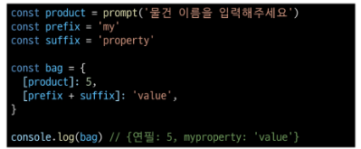
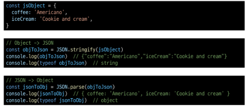
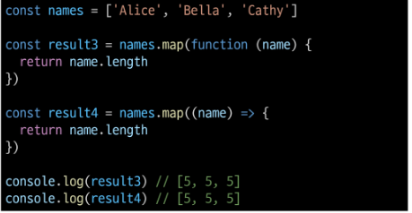

# 객체

## 개요

### Object

- 키로 구분된 데이터 집합을 저장하는 자료형

## 구조 및 속성

### 객체 구조

- 중괄화 ('{}')를 이용해 작성

- 중괄호 안에는 key: value 쌍으로 구성된 속성(property)를 여러 개 작성 가능

- key는 문자형만 허용

- value는 모든 자료형 허용

### 속성 참조

- 점('.', chaining operator) 또는 대괄호('[]')로 객체 요소 접근

- key 이름에 띄어쓰기 같은 구분자가 있으면 대괄호 접근만 가능

### 'in' 연산자

- 속성이 객체에 존재하는지 여부를 확인

## 메서드

### Method

- 객체 속성에 정의된 함수

### Method 사용 예시

- object.method() 방식으로 호출

- 메서드는 객체를 '행동'할 수 있게 함

## this

### Method

- 객체 속성에 정의된 함수

- > 'this' 키워드를 사용해 객체애 대한 특정한 작업을 수행 할 수 있음

### 'this' keyword

- 함수나 메서드를 호출한 객체를 가리키는 키워드

- > 함수 내에서 객체의 속성 및 메서드에 접근하기 위해 사용

### Method & this 사용 예시

### JavaScript에서 this는 함수를 "호출하는 방법"에 따라 가리키는 대상이 다름

### 1. 단순 호출 시 this

- 가리키는 대상 => 전역 객체

### 2. 메서드 호출 시 this

- 가리키는 대상 => 메서드를 호출한 객체

### 중첩된 함수에서의 this 문제점과 해결책

### JavaScript 'this' 정리

- JavaScript의 함수는 호출될 때 this를 암묵적으로 전달 받음

- JavaScript에서 this는 함수가 "호출되는 방식"에 따라 결정되는 현재 객체를 나타냄

- Python의 self와 Java의 this가 선언 시 이미 값이 정해지는 것에 비해 JavaScript의 this는 함수가 호출되기 전까지 값이 할당되지 않고 호출 시에 결정됨 (동적 할당)

- this가 미리 정해지지 않고 호출 방식에 의해 결정되는 것은

- 장점
  - 함수(메서드)를 하나만 만들어 여러 객체에서 재사용할 수 있다는 것

- 단점
  - 이런 유연함이 실수로 이어질 수 있다는 것

- > 개발자는 this의 동작 방식을 충분히 이해하고 장점을 취하면서 실수를 피하는 데에 집중

## 추가 객체 문법

### 1. 단축 속성

- 키 이름과 값으로 쓰이는 변수의 이름이 같은 경우 단축 구문을 사용할 수 있음

### 2. 단축 메서드

- 메서드 선언 시 function 키워드 생략 가능

### 3. 계산된 속성 (computed property name)

- 키가 대괄호([])로 둘러싸여 있는 속성

- > 고정된 값이 아닌 변수 값을 사용할 수 있음

### 4. 구조 분해 할당 (destructing assignment)

- 배열 또는 객체를 분해하여 객체 속성을 변수에 쉽게 할당할 수 있는 문법

- '함수의 매개변수'로 객체 구조 분해 할당 활용 가능

### 5. Object with '전개 구문'

- "객체 복사"
  - 객체 내부에서 객체 전개

- 얕은 복사에 활용 가능

### 6. 유용한 객체 메서드

- Object.keys()

- Object.values()

### 7. Optional chaining ('?.')

- 속성이 없는 중첩 객체를 에러 없이 접근할 수 있는 방법

- 만약 참조 대상이 null 또는 undefined라면 에러가 발생하는 것 대신 평가를 멈추고 undefined를 반환

- 만약 Optional chaining을 사용하지 않는다면 다음과 같이 '&&' 연산자를 사용해야 함

### 7. Optional chaining 장점

- 참조가 누락될 가능성이 있는 경우 연결된 속성으로 접근할 때 더 짧고 간단한 표현식을 작성할 수 있음

- 어떤 속성이 필요한지에 대한 보증이 확실하지 않는 경우에 객체의 내용을 보다 편리하게 탐색할 수 있음

### 7. Optional chaining 주의사항

1. Optional chaining은 존재하지 않아도 괜찮은 대상에만 사용해야 함 (남용 X)
  - 왼쪽 평가 대상이 없어도 괜찮은 경우에만 선택적으로 사용
  - 중첩 객체를 에러 없이 접근하는 것이 사용 목적이기 때문

  

2. Optional chaining 앞의 변수는 반드시 선언되어 있어야 함

### 7. Optional chaining 정리

1. obj?.prop
  - obj가 존재하면 obj.prop을 반환하고, 그렇지 않으면 undefined를 반환

2. obj?.[prop]
  - obj가 존재하면 obj[prop]을 반환하고, 그렇지 않으면 undefined를 반환

3. obj?.method()
  - obj가 존재하면 obj.method()를 호출하고, 그렇지 않으면 undefined를 반환

## JSON

### JSON

- "JavaScript Object Notation"

- Key-Value 형태로 이루어진 자료 표기법

- JavaScripts의 Object와 유사한 구조를 가지고 있지만 JSON은 형식이 있는 "문자열"

- JavaScripts에서 JSON을 사용하기 위해서는 Object 자료형으로 변경해야 함

### Object <-> JSON 반환하기

# 배열

## 개요

### Object

- 키로 구분된 데이터 집합(data collection)을 저장하는 자료형

- > 이제는 순서가 있는 collection이 필요

### Array

- 순서가 있는 데이터 집합을 저장하는 자료구조

### 배열 구조

- 대괄호('[]')를 이용해 작성

- 요소의 자료형은 제약 없음

- length 속성을 사용해 배열에 담긴 요소 개수 확인 가능

## 배열 메서드

### 주요 메서드

### push()

- 배열 끝에 요소를 추가

### pop()

- 배열 끝 요소를 제거하고, 제거한 요소를 반환

### unshift()

- 배열 앞에 요소를 추가

### shift()

- 배열 앞 요소를 제거하고, 제거한 요소를 반환

# Array helper method

### Array Helpr Methods

- 배열 조작을 보다 쉽게 수행할 수 있는 특별한 메서드 모음

- ES6에 도입

- 배열의 각 요소를 순회하며 각 요소에 대해 함수 (콜백함수)를 호출

- 대표 메서드
  - forEach(), map(), filter(), every(), some(), reduce() 등

- > 메서드 호출 시 인자로 함수(콜백함수)를 받는 것이 특징

## 콜백 함수

### 콜백 함수(Callback function)

- 다른 함수에 인자로 전달되는 함수

- > 외부 함수 내에서 호출되어 일종의 루틴이나 특정 작업을 진행

### 주요 Array Helper Methods

## forEach

### forEach()

- 배열의 각 요소를 반복하며 모든 요소에 대해 함수(콜백 함수)를 호출

### forEach 구조

- 콜백함수는 3가지 매개변수로 구성

    1. item: 처리할 배열의 요소
    2. index: 처리할 배열 요소의 인덱스 (선택 인자)
    3. array: forEach를 호출한 배열 (선택 인자)

- 반환 값
  - undefined

### forEach 예시

- 출력 결과

### forEach 활용

- forEach의 인자를 모두 활용

- 출력 결과

## map

### map()

- 배열의 모든 요소에 대해 함수를 호출하고, 반환 된 호출 결과 값을 모아 새로운 배열을 반환

### map 구조

- forEach의 매개 변수와 동일

- 반환 값
  - 배열의 각 요소에 대해 실행한 "callback의 결과를 모은 새로운 배열"
  - > forEach 동작 원리와 같지만 forEach와 달리 새로운 배열은 반환함

### map 예시

- 배열을 순회하며 각 객체의 name 속성 값을 추출하기 (for...of와 비교)

### map 활용

- 커스텀 콜백 함수 활용

### python에서의 map 함수와 비교

- python의 map에 square 함수를 인자로 넘겨 numbers 배열의 각 요소를 square 함수의 인자로 사용하였음

- map 메서드에 callBackFunc 함수를 인자로 넘겨 numbers 배열의 각 요소를 callBackFunc 함수의 인자로 사용하였음

## 배열 순회 종합

### 배열 순회 종합

### 기타 Array Helper Methods

- MDN 문서를 참고해 사용해보기

## 배열 with '전개 구문'

### 배열 with '전개 구문'

- "배열 복사"

# <참고>

## 클래스

### 클래스의 필요성

- JS에서 객체를 하나 생성한다고 한다면?
  - 하나의 객체를 선언하여 생성

- 동일한 형태의 객체를 또 만든다면?
  - 또 다른 객체를 선언하여 생성해야 함

- > 불편한데... 좋은 방법이 없을까?

### 클래스

- 객체를 생성하기 위한 템프릿

- > 객체의 속성, 메서드를 정의하는 청사진 역할

### 클래스 기본 문법

1. class 키워드

2. 클래스 이름

3. 생성자 메서드
    - constructor()

### 클래스 특징

- ES6에서 도입

- 생성자 함수를 사용하여 객체를 생성하는 이전의 방식을 객체 지향적으로 표현하고자 만들어짐

- 그래서 클래스는 내부적으로 생성자 함수를 기반으로 동작함

### 클래스 활용

### 'new' 연산자

- 클래스나 생성자 함수를 사용하여 새로운 객체를 생성

### 'new' 연산자 특징

- 클래스의 constructor()는 new 연산제에 의해 자동으로 호출되며 특별한 절차 없이 객체를 초기화 할 수 있음

- new 없이 클래스를 호출하면 TypeError 발생

## 콜백 함수의 이점

### 콜백 함수 구조를 사용하는 이유

1. 함수의 재사용성 측면

2. 비동기적 처리 측면

### 1. 함수의 재사용성 측면

- 함수를 호출하는 코드에서 콜백 함수의 동작을 자유롭게 변경할 수 있음

- 예를 들어, map 함수는 콜백 함수를 인자로 받아 배열의 각 요소를 순회하며 콜백 함수를 실행

- 이때, 콜백 함수는 각 요소를 변환하는 로직을 담당하므로, map 함수를 호출하는 코드는 간결하고 가독성이 높아짐

### 2. 비동기적 처리 측면

- setTimeout 함수는 콜백 함수를 인자로 받아 일정 시간이 지난 후에 실행됨

- 이때, setTimeout 함수는 비동기적으로 콜백 함수를 실행하므로, 다른 코드의 실행을 방해하지 않음 (비동기 JavaScript에서 자세히 진행 예정)

## forEach에서 braek 사용하기

### forEach에서 break하는 대안

- forEach에서 break 키워드를 사용할 수 없음

- 대신 some과 every의 특징을 활용해 마치 break를 사용하는 것처럼 활용 할 수 있음

- some을 활용한 예시
  - 콜백 함수가 true를 반환하면 즉시 순회를 중단하는 특징을 활용

  

- every를 활용한 예시
  - 콜백 함수가 false를 반환하면 즉시 순회를 중단하는 특징을 활용

  

## 배열은 객체다

### "배열은 객체다"

- 배열도 키와 속성들을 담고 있는 참조 타입의 객체

- 배열의 요소를 대괄호 접근법을 사용해 접근하는 건 객체 문법과 같음
  - 배열의 키는 숫자

- 숫자형 키를 사용함으로써 배열은 객체 기본 기능 이외에도 "순서가 있는 컬렉션"을 제어하게 해주는 특별한 메서드를 제공하는 것

- 배열은 인덱스를 키로 가지며 length 속성을 갖는 특수한 객체

