# 이벤트

## 개요

### 일상속의 이벤트

- 컴퓨터 키보드를 눌러 텍스트를 입력하는 것

- 전화벨이 울려 전화가 왔음을 알리는 것

- 손을 흔들어인사하는 것

- 전화기의 버튼을 눌러서 통화를 시작하는 것

- 리모컨을 사용하여 채널을 변경하는 것

### 웹에서의 이벤트

- 화면을 스크롤하는 것

- 버튼을 클릭했을 때 팝업 창이 출력되는 것

- 마우스 커서의 위치에 따라 드래그 앤 드롭하는 것

- 사용자의 키보드 입력 값에 따라 새로운 요소를 생성하는 것

- > 웹에서의 모든 동작은 이벤트 발생과 함께 한다.

## event

- 웹 페이지 상에서 '무언가 일어났다는 신호 또는 사건'

- > 사용자가 버튼을 클릭하거나, 키보드를 누르거나, 입력 필드에 값을 변경하는 행위 등

### DOM 요소와 이벤트

- 모든 DOM 요소는 다양한 형태의 이벤트를 발생시킬 수 있음

- 예) button 요소를 클릭하면 click 이벤트, input 요소 값 변경 시 input 이벤트 발생 등

## event object

### 'event' object

- DOM에서 이벤트가 발생하면 브라우저는 해당 이벤트에 관한 정보를 담은 'event object'를 자동으로 생성

- 이벤트 종류
  - mouse, input, keyboard, touch _
  - https://developer.mozilla.org/en-US/docs/Web/API/Event

### 'event' object 역할

- 이벤트 객체는 이벤트 발생 순간의 상황(어떤 요소에서 이벤트가 발생했는지, 마우스 좌표는 어디인지, 눌린 키는 무엇인지 등)과 관련된 상세 정보를 담고 있음

- 이를 통해 이벤트와 관련된 구체적인 정보를 참조할 수 있음

### DOM 요소에서 event가 발생하면, 해당 event는 연결된 이벤트 처리기에 의해 처리 됨

## event handler

### event handler

- 특정 이벤트가 발생했을 때 실행되는 (콜백)함수

- > 보통 addEventListener를 통해 DOM 요소에 등록

### .addEventListener()

- 이벤트가 발생했을 때 실행할 이벤트 핸들러를 특정 DOM 요소에 등록하는 메서드

- > 이벤트 핸들러를 DOM 요소에 "연결"하는 역할을 담당

### .addEventListener() 예시

- handleClick 함수가 이벤트 핸들러이며, button.addEventListener()는 그 핸들러를 click 이벤트에 연결해주는 역할

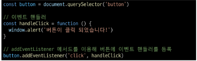

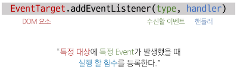

### addEventListener 구조

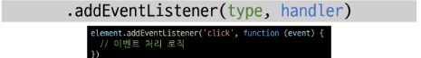

- type
  - 수신할 이벤트 유형
  - 문자열로 작성 (ex. 'click', 'mouseover' 등)

- handler
  - 이벤트 발생 시 호출되는 콜백 함수
  - 자동으로 event 객체를 첫번째 매개변수로 받음
  - 반환 값 없음

### 이벤트 객체 전달

- 이벤트 발생 시, 이벤트 객체는 자동으로 이벤트 핸들러 함수에 인자로 전달됨

- 핸들러 함수는 이 인자를 통해 이벤트에 대한 상세 정보(이벤트 발생 요소, 이벤트 타입, 추가 데이터 등)에 접근하고 적절한 동작을 수행

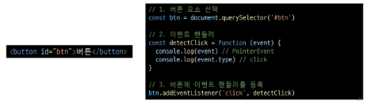

### 이벤트 핸들러에서의 this

- 요소에 addEventListener를 연결하게 되면 핸들러 내부의 this 값은 연결된 요소를 가리키게 됨 (event 객체의 currentTarget 속성 값과 동일)

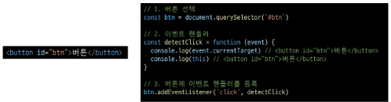

# 버블링

## 버블링

### 버블링 개요

- form > div > p 형태의 중첩된 구조에 각각 이벤트 핸들러가 연결되어 있을 때 만약 
 요소를 클릭하면 어떻게 될까?

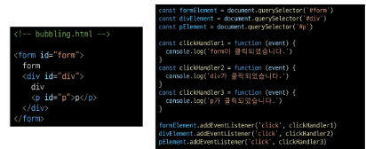

- 
 요소만 클릭했는데도 불구하고 모든 핸들러가 동작함

- > 왜 p만을 클릭했는데 부모 요소 div와 form에 할당된 핸들러까지 동작할까?

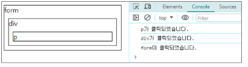

### 버블링 (Bubbling)

- "한 요소에 이벤트가 발생하면, 이 요소에 할당된 핸들러가 동작하고, 이어서 부모 요소의 핸들러가 동작하는 현상"

- 가장 최상단의 조상 요소(document)를 만날 때까지 이 과정이 반복되면서 요소 각각에 할당된 핸들러가 동작

- > 이벤트가 제일 깊은 곳에 있는 요소에서 시작해 부모 요소를 거슬러 올라가며 발생하는 것이 마치 물속 거품과 닮았기 때문

- > 최하위의 
 요소를 클릭하면 p -> div -> form 순서로 3개의 이벤트 핸들러가 모두 순차적으로 동작했던 것

### 이벤트가 정확히 어디서 발생했는지 접근할 수 있는 방법

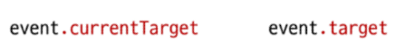

### 'currentTarget' & 'target' 속성

- 'currentTarget' 속성
  - '현재'요소
  - 항상 이벤트 핸들러가 연결된 요소만을 참조하는 속성
  - 'this'와 같음

- 'target' 속성
  - 이벤트가 발생한 가장 안쪽의 요소(target)를 참조하는 속성
  - 실제 이벤트가 시작된 요소
  - 버블링이 진행 되어도 변하지 않음

### 'target' & 'currentTarget' 예시

- 세 요소 중 가장 최상위 요소인 outerouter 요소에만 핸들러가 연결

- 각 요소를 클릭 했을 때 event의 target과 currentTarget의 차이 비교

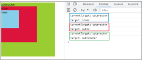

- 'currentTarget'
  - 핸들러가 연결된 outerouter 요소만을 가리킴

- 'target'
  - 실제 이벤트가 발생하는 요소를 가리킴

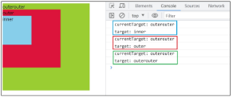

- 핸들러는 outerouter에만 연결되어 있지만 하위 요소 outer와 inner를 클릭해도 해당 핸들러가 동작함

- > 클릭 이벤트가 어디서 발생했든 상관없이 outerouter까지 이벤트가 버블링 되어 핸들러를 실행시키기 때문

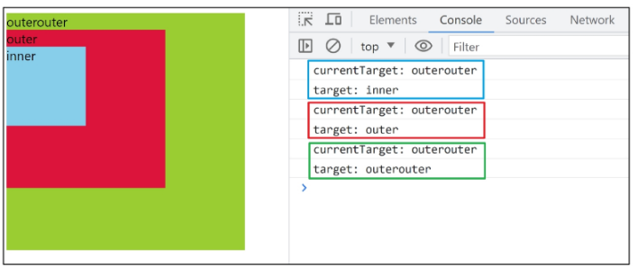

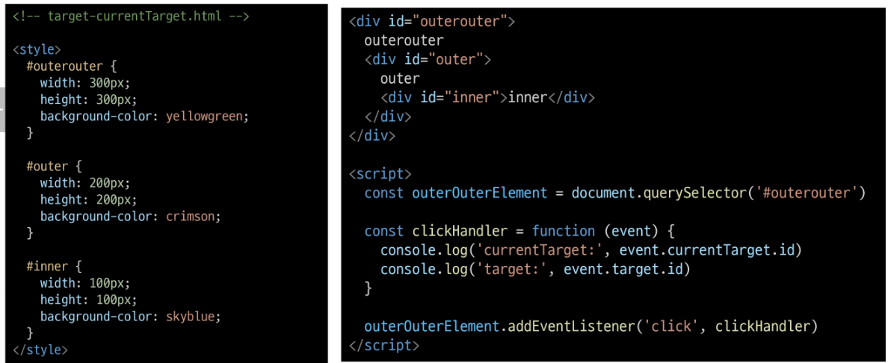

## 캡처링과 버블링

### 캡처링(capturing)

- 이벤트가 하위 요소로 전파되는 단계 (버블링과 반대)

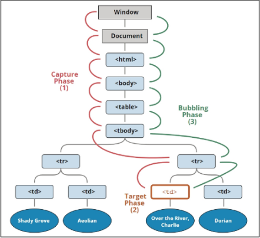

### 캡처링과 버블링

- table의 하위 요소 td를 클릭하면 이벤트는 먼저 최상위 요소부터 아래로 전파됨 (캡처링)

- 실제 이벤트가 발생한 지점 (event.target)에서 실행된 후 다시 위로 전파 (버블링)
  - 이 전파 과정에서 상위 요소에 할당된 이벤트 핸들러들이 호출되는 것

- > 캡처링은 실제 개발자가 다루는 경우가 거의 없으므로 버블링에 집중하기

## 버블링의 필요성

### 버블링이 필요한 이유

- 만약 다음과 같이 각자 다른 동작을 수행하는 버튼이 여러 개가 있다고 가정

- 그렇다면 각 버튼마다 서로 다른 이벤트 핸들러를 할당해야 할까?

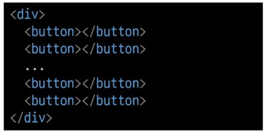

- 만약 다음과 같이 각자 다른 동작을 수행하는 버튼이 여러 개가 있다고 가정

- 그렇다면 각 버튼마다 서로 다른 이벤트 핸들러를 할당해야 할까?

- > 각 버튼의 공통 조상인 div 요소에 이벤트 핸들러 단 하나만 할당하기

- 요소의 공통 조상에 이벤트 핸들러를 단 하나만 할당하면, 여러 버튼 요소에서 발생하는 이벤트를 한꺼번에 다룰 수 있음

- 공통 조상에 할당한 핸들러에서 event.target을 이용하면 실제 어떤 버튼에서 이벤트가 발생했는지 알 수 있기 때문

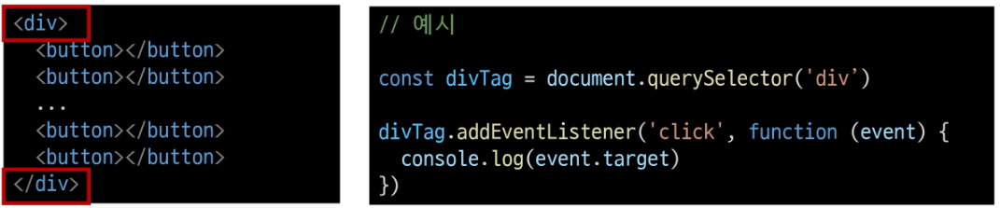

# event handler 활용

### event handler 활용 실습

1. 버튼을 클릭하면 숫자를 1씩 증가해서 출력하기

2. 사용자 입력 값을 실시간으로 출력하기

3. 사용자 입력 값을 실시간으로 출력하기 + 버튼을 클릭하면 출력된 값의 CSS 스타일을 변경하기

4. todo 프로그램 구현

5. 로또 번호 생성기 구현

### 1. click 이벤트 실습

- 버튼을 클릭하면 숫자를 1씩 증가

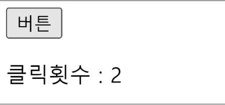

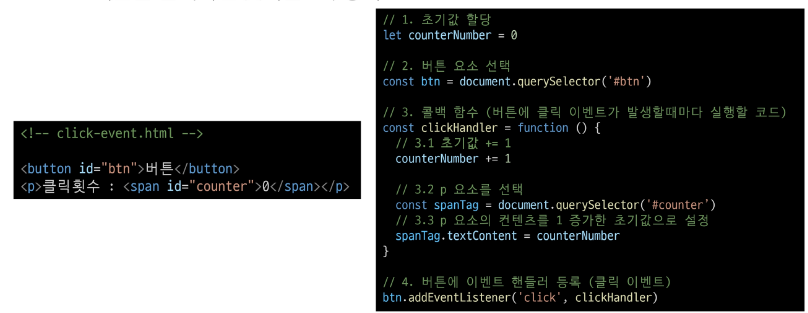

### 2. input 이벤트 실습

- 사용자의 입력 값을 실시간으로 출력하기

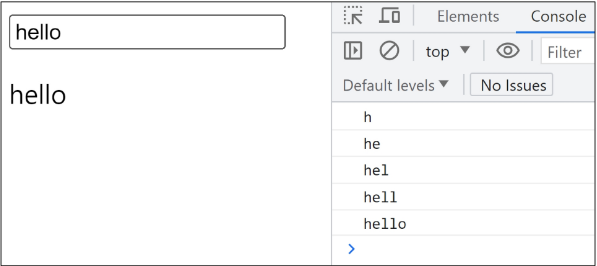

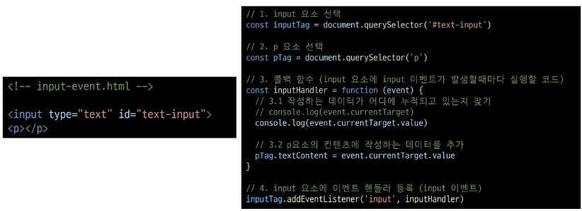

### 'currentTarget' 주의사항

- console.log()로 event 객체를 출력할 경우 currentTarget 키의 값은 null을 가짐

- currentTarget은 이벤트가 처리되는 동안에만 사용할 수 있기 때문

- 대신 console.log(event.currentTarget)을 사용하여 콘솔에서 확인 가능

- > currentTarget 이후의 속성 값들은 'target'을 참고해서 사용하기

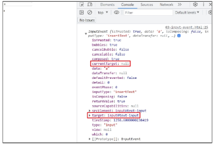

### 3. click & input 이벤트 실습

- 사용자의 입력 값을 실시간으로 출력
  - '+' 버튼을 클릭하면 출력한 값의 스타일을 변경하기

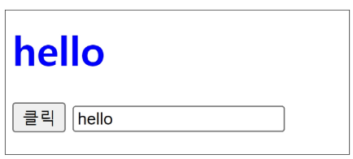

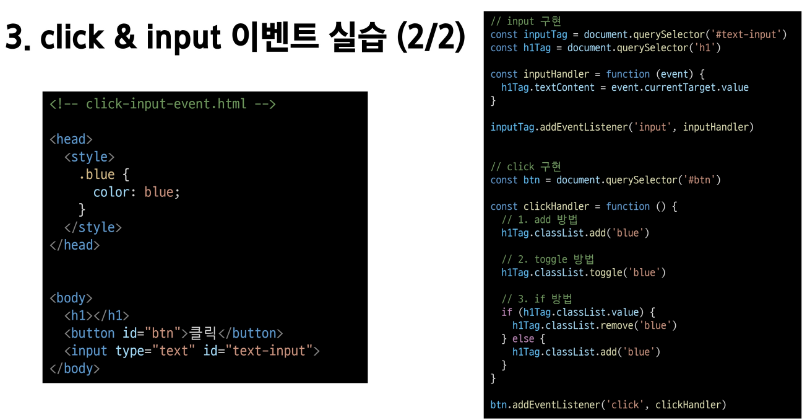

### 4. todo 실습

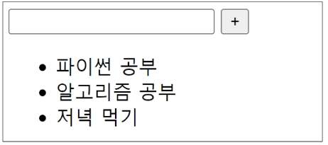

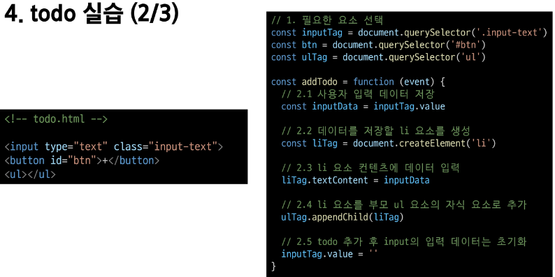

- todo 추가 기능 구현
    1. 빈 문자열 입력 방지
    2. 입력이 없을 경우 경고 대화상자를 띄움

    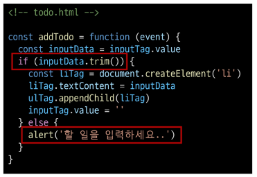

### 5. 로또 번호 생성기 실습

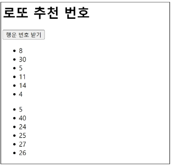

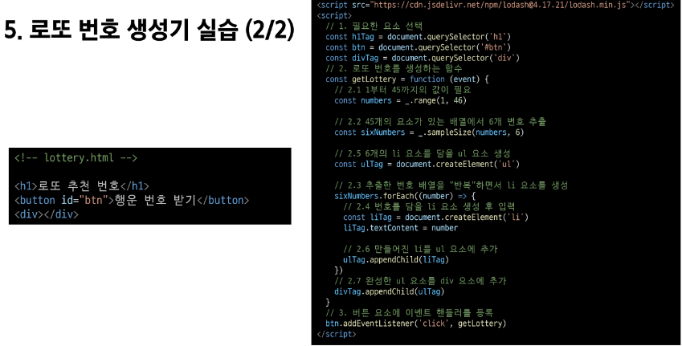

### lodash

- 모듈성, 성능 및 추가 기능을 제공하는 JavaScript 유틸리티 라이브러리

- array, object 등 자료구조를 다룰 때 사용하는 유용하고 간편한 함수들을 제공

- https://lodash.com/

## 이벤트 기본 동작 취소하기

### 이벤트 기본 동작 취소하기

- HTML의 각 요소가 기본적으로 가지고 있는 이벤트가 때로는 방해가 되는 경우가 있어 이벤트의 기본 동작을 취소할 필요가 있음

- 예시
  - form 요소의 제출 이벤트를 취소하여 페이지 새로고침을 막을 수 있음
  - a 요소를 클릭 할 때 페이지 이동을 막고 추가 로직을 수행할 수 있음

### .preventDefault()

- 해당 이벤트에 대한 기본 동작을 실행하지 않도록 지정

### 이벤트 동작 취소 실습

- copy 이벤트 동작 취소
  - 콘텐츠를 복사 하는 것을 방지

  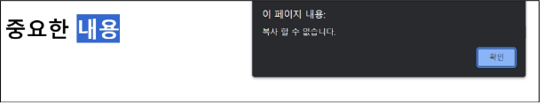

  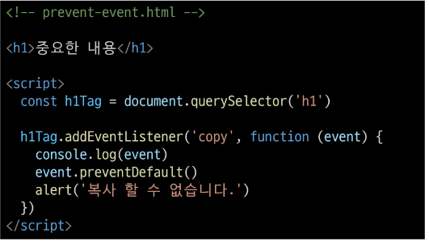

- form 제출 시 페이지 새로고침 동작 취소
  - form 요소의 submit 동작(action 값으로 요청)을 취소 시킴

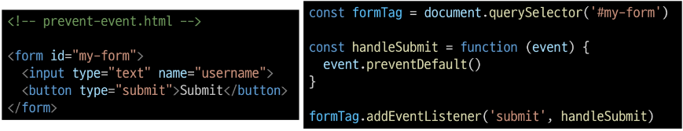

# <참고>

## addEventListener와 화살표 함수 관계

### addEventListener에서의 화살표 함수 주의사항

- 화살표 함수는 자신만의 this를 생성하지 않음

- 대신, 화살표 함수가 정의된 곳의 상위 스코프의 this를 그대로 사용

- 대부분의 경우, 이는 전역 객체(브라우저에서는 window)를 가리키게 됨

- 해결책
    
    1. 일반 함수로 사용하기
    2. 화살표 함수일 경우 event.currentTarget을 사용하기

    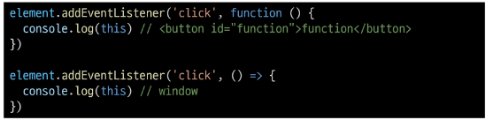