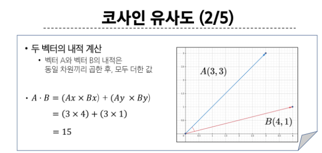
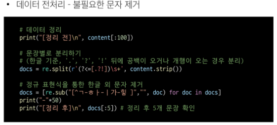
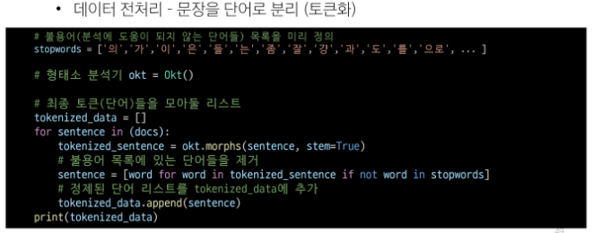
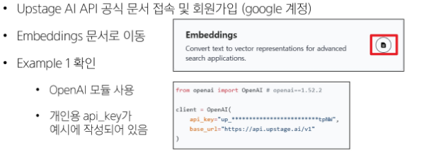
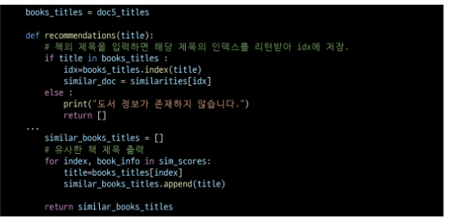

# 문서 유사도

## 문서 유사도란

### 문서 유사도

- 여러 개의 문서(또는 문장) 중에서 "얼마나 비슷한 내용을 담고 있는지"를 수치로 표현한 것

### 문서 유사도란

- 추천 시스템
  - 도서, 영화, 금융 상품 등에서 사용자의 관심사와 유사한 콘텐츠를 찾아 추천
- 검색 및 정보 탐색
  - 입력 쿼리(질문)와 유사한 문서를 빠르게 찾고, 검색 결과 품질을 높임
- 분류 군집 및 중복 검출
  - 뉴스 기사,논문 등이 서로 얼마나 유사한지 계산
    - > 중복 기사 묶음 처리, 토픽별 문서 분류
- 의사결정 지원
  - 방대한 문서(보고서, 계약서 등) 중 유사 문서나 핵심 정보를 신속히 파악 가능

- 텍스트(문자)로 이루어진 문서라면, 사람이 읽고 비교하기 쉬움
- 아래 예시 중, 가장 "유사"한 문장을 2개 선택한다면?

1. 먹고 싶은 사과
2. 먹고 싶은 바나나
3. 길고 노란 바나나 바나나
4. 저는 과일이 좋아요

- 누구든지 1번과 2번 문장이 "가장 유사"하다고 선택 할 것
- 그 외 문장들간의 관계에 대해서도 "어느 정도 연관은 있음" 이라고 판별

- 그러나!
- 문장들의 길이가 아주 길어진다면 어떻게 판별 할 수 있을까?
- 비교해야 하는 문서의 양이 많아진다면?
- 정확히 어느 정도로 유사한지를 정량화 하고자 한다면?

# 문서 유사도 계산 방법

## 문서 유사도 계산 방법

### 문서 유사도 계산 방법

## 코사인 & 벡터

### 벡터

### 코사인

## 코사인 유사도

### 코사인 유사도 코드

### 결론

- 두 벡터의 관계를 코사인 값으로 나타내는 것이 목표
- 벡터를 활용하므로, 2차원 데이터가 아닌 경우에도 연산에는 문제없음
  - n차원으로 표기되는 데이터의 경우에도 직관적으로 시각화는 어려우나 수학적으로 정의는 가능
  - 예) 다음과 같은 경우에도, 코사인 유사도 식 연산 가능
    - vector A = (x1, x2, ..., xn)
    - vector B = (y1, y2, ..., ym)

# 카운트 기반 문서 유사도

### 카운트 기반 문서 유사도

- 코사인 유사도 방식으로 두 벡터 간의 유사도를 알아내려면 벡터 값이 필요
- 주어진 데이터는 텍스트(문자) 형태의 데이터
- 텍스트 기반 데이터를 벡터 데이터로 변환할 수 있는 방법이 필요

1. 먹고 싶은 사과
2. 먹고 싶은 바나나
3. 길고 노란 바나나 바나나
4. 저는 과일이 좋아요

## 사전 준비

### google colab 활용

- 사전에 제공된 ipynb 파일들을 단계별로 colab에서 실행

## Bag of Words

- 고유 단어 추출
  - 불용어(조사, 접속사 등)를 제거 -> 더 높은 정확도

- 각 단어에 인덱스 부여
  - 사전순 혹은 등장 순서대로 인덱스를 부여

- 문서 별 각 단어의 등장 빈도수 기록
  - 문서 내 등장 횟수를 해당 단어의 인덱스 위치에 기록

- 문서 별 빈도 벡터 정보
  - 단, 아래 예시는 편의상 불용어 제거 과정을 거치지 않음.

  

### Bag of Words 구현

### 카운트 기반 문서 유사도 한계점

- 문서(단어) 벡터간 유의미한 유사도를 계산할 수 없음

- '사과'와 '바나나'는 과일이라는 공통점을 가지고 있으나, 해당 정보를 단어 카운트 행렬에서는 반영할 수 있은 방법이 없음
  - 그 결과 1번 문서와 3번 문서의 유사도가 0으로 나오게 됨

1. 먹고 싶은 사과
2. ...
3. 길고 노란 바나나 바나나

# 임베딩 기반 문서 유사도

## 임베딩

### 워드 임베딩

- 텍스트를 '의미'를 반영한 숫자 벡터로 변환하는 기법

### Word Embedding

- 단순히 단어 등장 횟수를 세는 방식(Bag of Words 등)으로는 '사과'와 '배'가 과일이라는 의미적 유사도를 충분히 반영하기 어려움

- 임베딩 과정을 통해, 서로 의미가 비슷한 단어,문장이 고차원 벡터 공간 상에서 가까이 위치하도록 학습 시킴

- 임베딩 된 벡터들을 서로 코사인 유사도 등으로 간단히 비교 가능하며, 훨씬 정교한 문서(단어)간 유사도 계산이 가능해짐

### 임베딩 기반 문서 유사도

- 데이터 수집
  - 실습에서는 '대한민국 헌법.txt'파일 활용

- 데이터 전처리
  - 토큰화: 띄어쓰기(또는 형태소) 기준으로 분리
  - 한글이 아닌 표현(이모지, 꺽쇠 등) 제거
  - 불용어 제거: 벡터로 만들 필요가 없거나 지나치게 많이 사용되는 단어 제거 (조사 등)

- 임베딩용 딥러닝 모델 설계 (Word2Vec, Doc2Vec등 사용 예정)

## Word2Vec

- 분포 가설에 기반하여 단어의 의미를 벡터로 '학습'
  - "서로 비슷한 맥락에서 등장하는 단어들은 의미도 비슷한다."

- 주변 단어를 보고 중심 단어를 맞히거나 학습하면, 단어 간 의미 관계가 유사한 벡터로 학습

- 학습 방식
  - CBOW: 주변 단어들을 입력으로 받고(맥락), 그 중심 단어를 예측하는 방식
  - Skip-gram: 중심 단어를 입력으로 받고, 주변 단어들을 예측하는 방식

### [참고] Word2Vec - CBOW 예시

### Word2Vec 활용

- 필요한 라이브러리 설치

  - Gensim
    - 자연어 처리 라이브러리
    - Word2Vec, Doc2Vec 등 임베딩 관련 알고리즘 지원

  - Konlpy
    - 한국어 자연어 처리(NLP)에 특화된 라이브러리
    - 형태소 분석기, 불용어 제거 등의 기초 전처리 지원

### 주의사항

- colab의 기본 제공 numpy 버전은 2.0.2

- 2025.4월 기준, 최신 버전의 gensim은 numpy 1.26.4 버전을 사용중
    1. gensim 설치 과정에서 numpy 버전이 1.26.4로 조정되었음
    2. 그러나, 현재 실행중인 세션 환경에서는 여전히 numpy 버전이 2.0.2
    3. 런타임 > `세션 다시 시작`을 통해 실행중인 numpy 버전을 1.26.4로 갱신 필요
    4. numpy version 확인

- `세션 다시 시작`전에 numpy 버전을 확인할 경우, 1.26.4 버전으로 출력되지만, 실제로는 2.0.2버전을 사용중이므로, 반드시 `세션 다시 시작`을 실행하셔야 합니다.

### Word2Vec 활용

## Doc2Vec

### 도큐먼트 임베딩

- 여러 단어로 이루어진 문장, 문서를 임베딩 하는 방법

### Document Embedding

- 문서별로 고유 문서 태그(문서 ID)를 부여

- Word2Vec과 유사하게 중심 단어와 주변 단어를 예측
  - 문서(문장)를 대표하는 문서 태그를 은닉층에 함께 학습
  - 이 문서 태그 임베딩이 결국 해당 문서를 대표하는 벡터가 됨

- 문서의 단어들을 입력으로 받고(또는 Skip-Gram이면 단어를 예측)

- Doc2Vec 모델을 사용하여 "문서 태그 + 단어 임베딩"을 동시에 업데이트

### Doc2Vec 활용

### 결과가 만족스럽지 못한 이유는?

1. 문장 길이가 너무 짧고 단어 수가 적음
  - 학습 정보가 부족하여, 모델이 제대로 구분할 만한 특징을 잡기 어려움

2. 주제별 키워드가 불충분하거나 겹치는 어휘가 많음
  - "기계학습","데이터"등 핵심 단어가 충분히 반복되어야 함

3. 학습 파라미터 및 데이터 규모 한계
  - 소수의 짧은 문장만으로 Doc2Vec을 학습하면, 토픽별 임베딩이 명확히 분리되지 않을 수 있음

## 정리

### Word2Vec VS Doc2Vec

## 생성형 AI 기반 임베딩

### 생성형 AI 기반 임베딩

### OpenAI API 활용

## 생성형 AI 기반 임베딩 2

### Upstage embeddings 시작하기

### Upstage AI API 활용

### 임베딩 기반 문서 유사도 응용

- 도서 정보를 토대로 도서간 유사도 값을 계싼
- 도서의 고유 ISBN 값 (예시에서는 index)을 활용하여 도서 추천기능 구현
    1. 도서 제목을 입력 받음
    2. 입력 받은 제목의 도서가 기존 DB에 존재하는지 확인
    3. 있다면, 해당 도서의 코사인 유사도 계산 결과 값 활용
    4. 가장 유사도가 높은 값을 가진 책의 고유값 변환
    5. 반환 받은 값으로 DB에서 도서 제목 검색
    6. 사용자에게 도서 제목 반환

    

# <참고>

### pickle

- 파이썬 객체 구조의 직렬화와 역 직렬화를 위한 바이너리 프로토콜을 구현

### 벡터 데이터 직렬화

