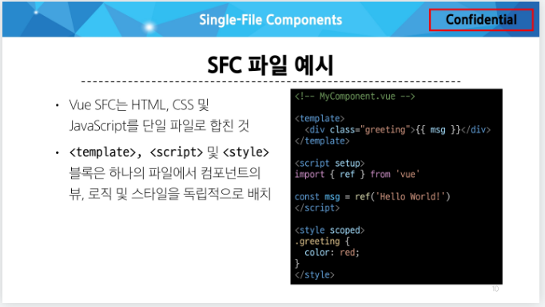

# Single-File Components

## Component

### Component

- 재사용 가능한 코드 블록

### Component 특징

- UI를 독립적이고 재사용 가능한 일부분으로 분할하고 각 부분을 개별적으로 다룰 수 있음

- > 자연스럽게 애플리케이션은 중첩된 Component의 트리 형태로 구성됨

### Component 예시

- 웹 서비스는 여러 개의 Component로 이루어져 있음

### Single-File Components(SFC)

- 컴포넌트의 템플릿, 로직 및 스타일을 하나의 파일로 묶어낸 특수한 파일 형식 (*.vue 파일)

### SFC 파일 예시

- Vue SFC는 HTML, CSS 및 JavaScript를 단일 파일로 합친 것

- <template>, <script> 및 <style> 블록은 하나의 파일에서 컴포넌트의 뷰, 로직 및 스타일을 독립적으로 배치

## SFC 구성요소

### SFC 구성요소

- 각 *.vue 파일은 세 가지 유형의 최상위 언어 블록 <template>, <script>, <style>으로 구성됨
- > 언어 블록의 작성 순서는 상관 없으나 일반적으로 template -> script -> style 순서로 

### <template> 블록

- 각 *.vue 파일은 최상위 <template> 블록을 하나만 포함할 수 있음

### <script setup> 블록

- 각 *.vue 파일은 <script setup> 블록을 하나만 포함할 수 있음 (일반 <script> 제외)

- 컴포넌트의 setup() 함수로 사용되며 컴포넌트의 각 인스턴스에 대해 실행

- > 변수 및 함수는 동일한 컴포넌트의 템플릿에서 자동으로 사용 가능

### <style scoped> 블록

- *.vue 파일에는 여러 <style> 태그가 포함될 수 있음

- scoped가 지정되면 CSS는 현재 컴포넌트에만 적용됨

### 컴포넌트 사용하기

- https://play.vuejs.org/ 에서 Vue 컴포넌트 코드 작성 및 미리보기

- Vue SFC는 일반적인 방법으로 실행할 수 없으며 컴파일러를 통해 컴파일 된 후 빌드 되어야 함

- > 실제 프로젝트에서는 Vite와 같은 공식 빌드(build) 도구를 사용

# SFC build tool

## Vite

### Vite

- 프론트 엔드 개발 도구

- > 빠른 개발 환경을 위한 빌드 도구와 개발 서버를 제공
- https://vitejs.dev/

### Build

- 프로젝트의 소스 코드를 최적화하고 번들링하여 배포할 수 있는 형식으로 변환하는 과정

- 개발 중에 사용되는 여러 소스 파일 및 리소스(JavaScript, CSS, 이미지 등)를 최적화된  형태로 조합하여 최종 소프트웨어 제품을 생성하는 것

- > Vite는 이러한 빌드 프로세스를 수행하는 데 사용되는 도구

## Vue Project

### Vue Project 생성

- Vue Project(Application)생성 (Vite 기반 빌드)

- 프로젝트명 설정
  - tab 클릭 시 기본 값 사용
  - enter 클릭 시 결정 후 진행

  

- 프로젝트에 추가 할 설정 선택
  - space 클릭 시 중복 선택 가능
  - enter 클릭 시 결정 후 진행

  

- 프로젝트 생성 완료

- 프로젝트 폴더 이동

- 패키지 설치

- Vue 프로젝트 서버 실행

- Vue 프로젝트 실행 결과

- Vue 프로젝트 구성

## NPM

### Node Package Manager(NPM)

- Node.js의 기폰 패키지 관리자

### Node.js의 영향

- 기존에 브랑저 안에서만 동작할 수 있었던 JavaScript를 브라우저가 아닌 서버 측에서도 실행할 수 있게 함
  - > 프론트엔드와 백엔드에서 동일한 언어로 개발할 수 있게 됨

- NPM을 활용해 수많은 오픈 소스 패키지와 라이브러리를 제공하여 개발자들이 손쉽게 코드를 공유하고 재사용할 수 있게 함

## 모듈과 번들러

### Module

- 프로그램을 구성하는 독립적인 코드 블록 (*.js 파일)

### Module의 필요성

- 개발하는 애플리케이션의 크기가 커지고 복잡해지면서 파일 하나에 모든 기능을 담기가 어려워 짐

- 따라서 자연스럽게 파일을 여러 개로 분리하여 관리를 하게 되었고, 이때 분리된 각 파일이 바로 모듈(module)

- > *.js 파일 하나가 하나의 모듈

### Module의 한계

- 하지만 애플리케이션이 점점 더 발전함에 따라 처리해야 하는 JavaScript 모듈의 개수도 극적으로 증가

- 이러한 상황에서 성능 병목 현상이 반생하고 모듈 간의 의존성(연결성)이 깊어지면서 특정한 곳에서 발생한 문제가 어떤 모듈 간의 문제인지 파악하기 어려워 짐

- 복잡하고 깊은 모듈 간 의존성 문제를 해결하기 위한 도구가 필요
  - > Bundler

### node-modules의 의존성 깊이

### Bundler

- 여러 모듈과 파일을 하나(혹은 여러 개)의 번들로 묶어 최적화하여 애플리케이션에서 사용할 수 있게 만들어주는 도구

### Bundler의 역할

- 의존성 관리, 코드 최적화, 리소스 관리 등

- Bundler가 하는 작업을 Bundling이라 함

- > [참고] Vite는 Rollup이라는 Bundler를 사용하며 개발자가 별도로 기타 환경설정에 신경 쓰지 않도록 모두 설정해두고 있음

# Vue Project 구조

## 기본 구조

### public 디렉토리

- 주로 다음 정적 파일을 위치 시킴
  - 소스코드에서 참조되지 않는
  - 항상 같은 이름을 갖는
  - import 할 필요 없는

- 항상 root 절대 경로를 사용하여 참조
  - public/icon.png는 소스 코드에서 /icon.png호 참조 할 수 있음

  

### src 디렉토리

- 프로젝트의 주요 소스 코드를 포함하는 곳

- 실제로 우리가 작업하게 될 대부분의 소스 코드가 위치

- 컴포넌트, 스타일, 라우팅 등 프로젝트의 핵심 코드를 관리

### src/assets

- 프로젝트 내에서 사용되는 정적 자원 (이미지, 폰트, 스타일 시트 등)을 관리

- 컴포넌트 자체에서 참조하는 내부 파일을 저장하는데 사용

- 컴포넌트가 아닌 곳에서는 public 디렉토리에 위치한 파일을 사용

### src/coponents

- 실제로 페이지에서 사용하게 될 개별 Vue 컴포넌트들이 위치

### src/App.vue

- Vue 앱의 Root 컴포넌트

- 다른 하위 컴포넌트들을 포함

- 애플리케션 전체의 레이아웃과 공통적인 요소를 정의

### src.main.js

- Vue 애플리케이션을 초기화하고, App.vue를 DOM에 마운트하는 시작점

- 필요한 라이브러리를 import 하고 전역 설정을 수행

### index.html

- Vue 앱의 기본 HTML 파일

- main.js에서 App.vue 컴포넌트를 렌더링해 이 index.html의 특정 위치에 마운트 시킴
  - > Vue 앱이 SPA인 이유

- 필요한 스타일 시트, 스크립트 등의 외부 리소스를 로드 할 수 있음 (ex. bootstrap CDN)

### 기타 설정 파일

- jsconfig.json
  - 컴파일 옵션, 모듈 시스템 등 설정

- vite.config.js
  - Vite 프로젝트 설정 파일
  - 플러그인, 빌드 옵션, 개발 서버 설정 등

  

## 패키지 관리

### package.json

- 프로젝트에 관한 기본 정보와 패키지 의존성을 정의하는 "설계도" 파일 (메타데이터 파일)

### package.json 역할

- 프로젝트가 어떤 패키지를 사용하고, 어떤 스크립트를 실행할 수 있는지 명시

- npm install 시 이를 참조하여 패키지를 설치
  - 어떤 패키지를 설치해야 하는지 결정하는 기준 제공

### package.json 특징

- 프로젝트 메타 데이터
  - 프로젝트 이름, 버전, 스크립트 명령, 패키지 의존성 등의 정보가 명시됨

- 의존성(Dependencies) 목록
  - 어떤 패키지를 사용하는지, 어떤 버전 범위를 허용하는지를 기록

- > "집을 짓기 전에 필요한 재료 목록과 건축 계획서" (필요한 재료(패키지)와 대략적 규격(버전 범위을 알려주는 문서)

### package-lock.json

- pacakge.json을 기반으로 실제 설치된 패키지들의 "정확한 버전 정보"를 기록하는 파일

### package-lock.json 역할

- 실제로 어느 버전의 패키지가 설치되었는지 확정하고 기록

- 다른 환경에서도 동일한 패키지 구성을 재현 가능하게 함

### package-lock.json 특징

- 정확한 버전 고정
  - 프로젝트를 설치할 때 실제로 어떤 버전의 패키지가 설치되었는지를 기록

- 빌드 안전성 보장
  - 협업 또는 배포 환경에서, 모든 개발자가 동일한 패키지 버전을 사용하도록 보장

- 자동 관리
  - npm install 결과가 반영되어 매번 자동 업데이트

- > "장바구니에 담긴 물건들의 정확한 브랜드와 생산일자가 적힌 구매 내역서" (실제 구매된 물건(패키지)의 구체적 스펙을 담은 문서)

### pacakge-lock.json 요약

- 팀원 간, 혹은 다른 환경(서버, 클라이언트 PC)에서 동일한 버전의 패키지를 재현 가능하게 함

- > "장바구니에 실제로 담긴 물건들의 브랜드, 생산 일자까지 모두 기록한 상세 구매 내역서"

### node_modules

- package.json과 package-lock.json에 따라 실제로 설치된 모든 패키지가 저장되는 곳

### node_modules 역할

- 프로젝트 실행 시 필요한 모든 라이브러리와 코드 파일을 보관

- 애플리케이션 구동 시 참조되는 실제 데이터 저장소

### node_modules 특징

- npm install 을 통해 설치된 모든 패키지(모듈)들이 실제로 저장

- 개발 시 직접 수정할 필요는 없으며, npm insatll 시 자동 관리됨
  - 직접 수정하지 않고, 필요 시 npm install로 언제든 재생성 가능

- 용량이 매우 클 수 있으며, 협업 시 일반적으로 Git으로 추적하지 않음(.gitignore에 포함)

- > "계획서와 내역서대로 확보한 실제 건축 자재들이 쌓여 있는 창고" (설계와 구매 목록을 바탕으로 실제 물리적 자재(파일)들이 모여 있는 장소)

### 정리

- package.json
  - 어떤 패키지가 필요하고 어떤 비전 범위를 허용할지 정의하는 "설계도"

- package-lock.json
  - 실제로 설피한 패키지의 정확한 버전을 기록하는 "상세 내역서"

- node_modules
  - 이 설계도와 내역서에 따라 내려 받은 실제 패키지 "자재 창고"

# Vue Component 활용

### 컴포넌트 사용 2단계

1. 컴포넌트 파일 생성

2. 컴포넌트 등록 (import)

### 사전 준비

1. 초기에 생성된 모든 컴포넌트 삭제 (App.vue 제외)

2. App.vue 코드 초기화

### 1. 컴포넌트 파일 생성

- MyComponent.vue 생성

### 2. 컴포넌트 등록

- App 컴포넌트에 MyComponent를 등록

- App(부모) - MyComponent(자식) 관계 형성

- "@" - "src/" 경로를 뜻하는 약어

### 결과 확인

- Vue dev tools를 사용해 컴포넌트 관계 형성 확인

### 추가 하위 컴포넌트 등록 후 활용

- MyCoponentItem은 MyComponent의 자식 컴포넌트

- 컴포넌트의 재사용성 확인하기

### Component 이름 지정 스타일 가이드

- https://vuejs.org/style-guide/rules-strongly-recommended.html

# 추가 주제

## Virtual DOM

### Virtual DOM

- 가상의 DOM을 메모리에 저장하고 실제 DOM과 동기화하는 프로그래밍 개념

- 실제 DOM과의 변경 사항 비교를 통해 변경된 부분만 실제 DOM에 적용하는 방식

- 웹 애플리케이션의 성능을 향상시키기 위한 Vue의 내부 렌더링 기술

### 내부 렌더링 과정

### Virtual DOM 패턴의 장점

- 효율성
  - 실제 DOM 조작을 최소화하고, 변경된 부분만 업데이트하여 성능을 향상

- 반응성
  - 데이터의 변경을 감지하고, Virtual DOM을 효율적으로 갱신하여 UI를 자동으로 업데이트

- 추상화
  - 개발자는 실제 DOM 조작을 Vue에게 맡기고 컴포넌트와 템플릿을 활용하는 추상화된 프로그래밍 방식으로 원하는 UI 구조를 구성하고 관리할 수 있음

### Vitual DOM 주의사항

- 실제 DOM에 직접 접근하지 말 것
  - JavaScript에서 사용하는 DOM 접근 관련 메서드 사용 금지
  - querySelector, createElement, addEventListener 등

- > Vue의 ref()와 Lifecycle Hooks 함수를 사용해 간접적으로 접근하여 조작할 것

### 직접 DOM 엘리먼트에 접근해야 하는 경우

- ref 속성을 사용하여 특정 DOM 엘리먼트에 직접적인 참조를 얻을 수 있음

## Composition API & Option API

### Vue를 작성하는 2가지 스타일

### Composition API

- import해서 가져온 API 함수들을 사용하여 컴포넌트의 로직을 정의

- > Vue3 에서의 권장 방식

### Option API

- data, methods 및 mounted 같은 객체를 사용하여 컴포넌트의 로직을 정의

- > Vue2 에서의 작성 방식 (Vue3에서도 지원)

### Composition API와 Option API 비교

### API 별 권장 사항

- Composition API + SFC
  - 규모가 있는 앱의 전체를 구축하려는 경우

- Option API
  - 빌드 도구를 사용하지 않거나 복잡성이 낮은 프로젝트에서 사용하려는 경우

- https://vuejs.org/guide/extras/composition-api-faq.html

# <참고>

## Single Root Element

### 모든 컴포넌트에는 최상단 HTML 요소가 작성되는 것이 권장

- 가동성, 스타일링, 명확한 컴포넌트 구조를 위해 각 컴포넌트에는 최상단 HTML 요소를 작성해야 함 (Single Root Element)

## CSS scoped

### scoped 속성

- <style scoped>를 사용하면 해당 컴포넌트 내부의 스타일이 현재 컴포넌트 내부 요소에게만 적용되도록 범위를 제한하는 기능

- 즉, 스타일이 컴포넌트 바깥으로 유출되거나, 다른 컴포넌트에서 정의한 스타일이 현재 컴포넌트를 침범하지 않도록 막아 줌

### scoped를 사용하지 않을 경우

- <style>에 scoped를 붙이지 않으면, 해당 스타일은 전역(모든 컴포넌트)에 영향을 미침

- 예를 들어, 다른 컴포넌트에서도 div 태그를 사용했다면 그 스타일이 함께 적용됨

### 부모-자식 관계에서의 스타일 전파

- 일반적으로 scoped 스타일은 부모 컴포넌트의 스타일이 자식 컴포넌트에 영향을 미치지 않음

- 하지만 예외적으로 자식 컴포넌트의 "최상위 요소(root element)"에는 부모 컴포넌트의 scoped 스타일도 영향을 줄 수 있음

- 이는 부모가 자식 컴포넌트를 레이아웃 할 때 (예: 자식 컴포넌트의 외곽 박스 크기나 마진 조정) 필요한 경우가 있기 때문

- 즉, 자식 컴포넌트의 가장 바깥쪽을 감싸는 요소에 한해서는 부모의 scoped 스타일 적용이 의도적으로 허용되어 있음

- 다음과 같이 App(부모) 컴포넌트에 적용한 스타일에 scoped가 작성 되어 있지만, MyComponent(자식)의 최상위 요소(div)는 부모와 본인의 CSS 모두의 영향을 받기 때문에 부모 컴포넌트에 지정한 스타일이 적용됨

### 이유

- Vue는 부모 컴포넌트가 자식 컴포넌트의 최상위 요소 스타일을 제어할 수 있어야 레이아웃(배치) 목적을 쉽게 달성할 수 있다고 판단했기 때문

- 이로 인해 자식 컴포넌트의 root element는 부모와 자식 모두의 scoped 스타일이 영향을 미칠 수 있음

### scoped 속성 사용을 권장

- 최상위 App 컴포넌트에서 레이아웃 스타일을 전역적으로 구성할 수 있지만, 다른 모든 컴포넌트는 범위가 지정된 스타일을 사용하는 것을 권장

- https://vuejs.org/style-guide/rules-essential.html#use-component-scoped-styling

## Scaffolding

### Scaffolding (스캐폴딩)

- 새로운 프로젝트나 모듈을 시작하기 위해 초기 구조와 기본 코드를 자동으로 생성하는 과정

- 개발자들이 프로젝트를 시작하는 데 도움을 주는 틀이나 기반을 제공하는 작업

- 초기 설정, 폴더 구조, 파일 템플릿, 기본 코드 등을 자동으로 생성하여 개발자가 시작할 때 시간과 노력을 절약하고 일관된 구조를 유지할 수 있도록 도와줌

### "관심사항의 분리가 파일 유형의 분리와 동일한 것이 아니다."

- "HTML/CSS/JS를 한 파일에 혼합하는 게 괜찮을까?"

- > 프론트엔드 앱의 사용 목적이 점점 더 복잡해짐에 따라, 단순 파일 유형으로만 분리하게 될 경우 프로젝트의 목표를 달성 하는데 도움이 되지 않게 됨

## 패키지 관리 주의사항

### 패키지 관리 주의사항

1. npm install을 입력하는 위치
    - 항상 프로젝트 루트 디렉토리(프로젝틀를 생성한 폴더)에서 실행

2. node_modules 폴더 관리 주의
    - 필요할 때마다 npm install을 통해 재생성할 수 있으므로, 직접 수정하거나 Git으로 관리할 필요 없음

3. package.json과 pacakge-lock.json 직접 편집 자제
    - npm install 패키지명 명령을 통해 자동 업데이트하는 것이 안전

4. 문제가 발생했을 때 재설치 고려
    - 패키지 버전 충돌이나 이상 동작이 의심될 때는 node_modules 폴더를 삭제한 뒤 다시 npm install을 실행