# Router

# Routing

## 개요

### Routing

네트워크에서 경로를 선택하는 프로세스

- > 웹 애플리케이션에서 다른 페이지 간의 전환과 경로를 관리하는 기술

### SSR에서의 Routing

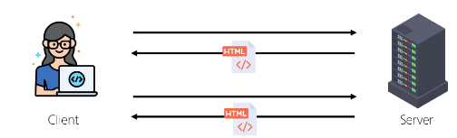

- SSR에서 routing은 서버 측에서 수행
- 서버가 사용자가 방문한 URL 경로를 기반으로 응답을 전송
- 링크를 클릭하면 브라우저는 서버로부터 HTML 응답을 수신하고 새 HTML로 전체 페이지를 다시 로드

### CSR에서의 Routing

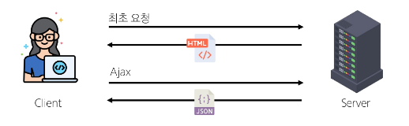

- CSR에서 routing은 클라이언트 측에서 수행
- 클라이언트 측 JavaScript가 새 데이터를 동적으로 가져와 전체 페이지를 다시 로드 하지 않음

### SPA에서 Routing이 없다면

- 유저가 URL을 통한 페이지의 변화를 감지할 수 없음
- 페이지가 무엇을 렌더링 중인지에 대한 상태를 알 수 없음
  - URL이 1개이기 때문에 새로 고침 시 처음 페이지로 되돌아감
  - 링크를 공유할 시 첫 페이지만 공유 가능
- 브라우저의 뒤로 가기 기능을 사용할 수 없음

- > 페이지는 1개이지만, 주소에 따라 여러 컴포넌트를 새로 렌더링하여 마치 여러 페이지를 사용하는 것처럼 보이도록 해야 함

# Vue Router

## 개요

### Vue Router

- Vue 공식 라우터 (The official Router for Vue.js)

### 사전 준비

- Vite로 프로젝트 생성 시 Router 추가
  
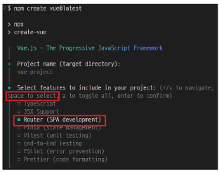

- 서버 실행 후 Router로 인한 프로젝트 변화 확인
- > Home, About 링크에 따라 변경되는 URL과 새로 렌더링 되는 화면

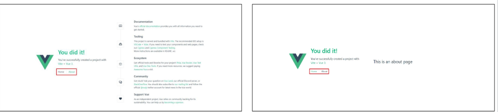

### Vue 프로젝트 구조 변화

1. App.vue 코드 변화
2. router 폴더 신규 생성
3. views 폴더 신규 생성

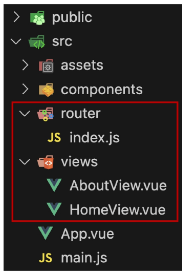

### RouterLink

- 페이지를 다시 로드 하지 않고 URL을 변경하여 URL 생성 및 관련 로직을 처리
- HTML의 <a>태그를 렌더링

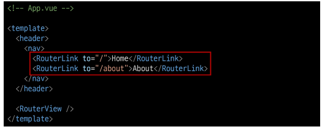

### RouterView

- RouterLink URL에 해당하는 컴포넌트를 표시
- 원하는 곳에 배치하여 컴포넌트를 레이아웃에 표시 할 수 있음

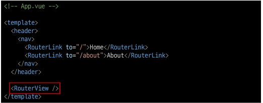

### RouterLink와 RouterView

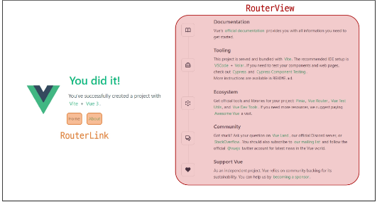

### router/index.js

- 라우팅에 관련된 정보 및 설정이 작성 되는 곳
- router에 URL과 컴포넌트를 매핑

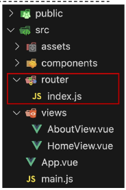

### views

- RouterView 위치에 렌더링 할 컴포넌트를 배치
- 기존 components 폴더와 기능적으로 다른 것은 없으며 단순 분류의 의미로 구성됨

- 일반 컴포넌트와 구분하기 위해 컴포넌트 이름을 View로 끝나도록 작성하는 것을 권장

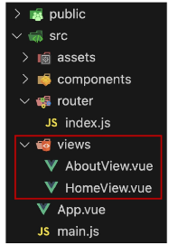

## Basic Routing

### 라우팅 기본

1. index.js에 라우터 관련 설정 작성(주소, 이름, 컴포넌트)

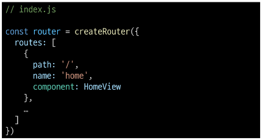

2. RouterLink의 'to' 속성으로 index.js에서 정의한 주소 값(path)을 사용

3. RouterLink 클릭 시 경로와 일치하는 컴포넌트가 RouterView에서 렌더링 됨

## Named Routes

### Named Routes

- 경로에 이름을 지정하는 라우팅

### Named Routes 예시

- name 속성 값에 경로에 대한 이름을 지정
- 경로에 연결하려면 RouterLink에 v-bind를 사용해 'to' props 객체로 전달

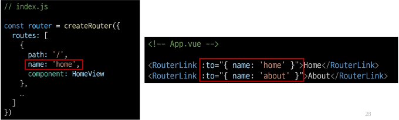

### Named Routes 장점

- 하드 코딩 된 URL을 사용하지 않아도 됨
- URL 입력 시 오타 방지

## Dynamic Route Matching

### Dynamic Route Matching

- URL의 일부를 변수로 사용하여 경로를 동적으로 매칭

### 매개변수를 사용한 동적 경로 매칭

- 주어진 패턴 경로를 동일한 컴포넌트에 매핑 해야 하는 경우 활용
- 예를 들어 모든 사용자의 ID를 활용하여 프로필 페이지 URL을 설계 한다면?
  - user/1
  - user/2
  - user/3
  - > 일정한 패턴의 URL 작성을 반복해야 함

### 매개변수를 사용한 동적 경로 매칭 활용

- views 폴더 내 UserView 컴포넌트 작성

- 매개변수는 콜론(":")으로 표기
- > UserView 컴포넌트 라우트 등록

- 매개변수는 객체의 params 속성의 객체 타입으로 전달
- 단, 객체의 key 이름과 index.js에서 지정한 매개변수 이름이 같아야 함
- > UserView 컴포넌트로 이동하기 위한 RouterLink 작성

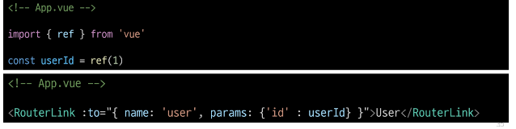

- 경로가 일치하면 라우트의 매개변수는 컴포넌트에서 $route.params로 참조 가능
- > 현재 사용자의 id를 출력하기

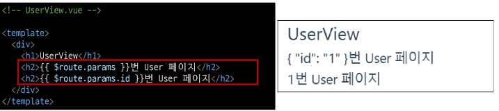

- useRoute() 함수를 사용해 스크립트 내에서 반응형 변수에 할당 후 템플릿에 출력하는 것을 권장
- 템플릿에서 $route를 사용하는 것과 동일

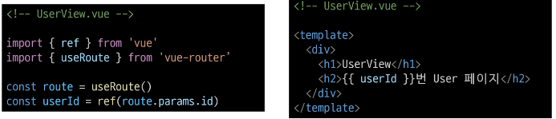

## Nested Routes

### Nested Routes

- 중첩된 라우팅

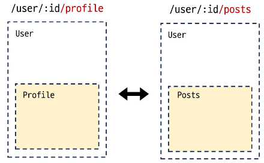

- 애플리케이션의 UI는 여러 레벨 깊이로 중첩된 컴포넌트로 구성되기도 함
- 이 경우 URL을 중첩된 컴포넌트의 구조에 따라 변경되도록 이 관계를 표현할 수 있음

### 중첩된 라우팅 활용

- 컴포넌트 생성
- > components 폴더에 UserProfile, UserPosts 컴포넌트 작성

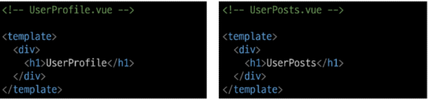

- 라우터 등록
- > index.js에 두 컴포넌트를 import

### children 옵션

- children 옵션은 배열 형태로 필요한 만큼 중첩 관계를 표현할 수 있음

### 중첩된 라우팅 활용

- "children" 옵션을 사용해 중첩된 라우터에 컴포넌트를 등록

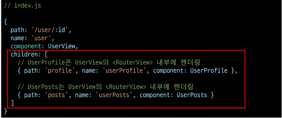

- 두 컴포넌트에 대한 RouterLink 및 RouterView 작성

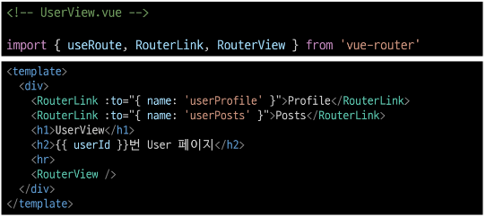

- Profile과 Posts 링크를 클릭해서 렌더링 결과 확인

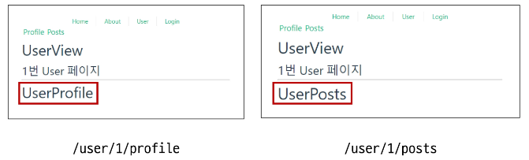

- 중첩된 Named Routes를 다룰 때는 일반적으로 "하위 경로에만 이름을 지정"
- 이렇게 하면 /user/:id로 이동했을 때 항상 중첩된 경로를 바로 렌더링 가능

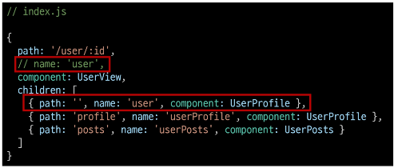

- 이제 /user/:id 접속 시 바로 중첩된 경로가 표시 (UserProfile)
- 단, 이전처럼 상위 경로의 이름을 유지하는 구조로 작성해도 무관

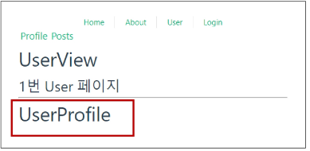

### 중첩된 라우팅 주의사항

- 컴포넌트 간 부모-자식 관계 관점이 아닌 "URL에서의 중첩된 관계를 표현"하는 관점으로 바라보기

## Programmatic Navigation

### Programmatic Navigation

- RouterLink 대신 JavaScript를 사용해 페이지를 이동하는 것

### 프로그래밍 방식 네비게이션

- 프로그래밍으로 URL 이동하기
- router의 인스턴스 메서드를 사용해 RouterLink로 <a> 태그를 만드는 것처럼 프로그래밍으로 네비게이션 관련 작업을 수행할 수 있음

### router의 메서드

1. 다른 위치로 이동하기
   1. router.push()
2. 현재 위치 바꾸기
   1. router.replace()

### router.push()

- 다른 위치로 이동하기 (Navigate to a different location)

- 다른 URL로 이동하는 메서드
- 새 항목을 history stack에 push하므로 사용자가 브라우저 뒤로 가기 버튼을 클릭하면 이전 URL로 이동할 수 있음
- RouterLink를 클릭했을 때 내부적으로 호출되는 메서드이므로 RouterLink를 클릭하는 것은 router.push()를 호출하는 것과 같음

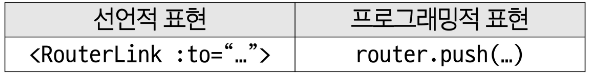

### router.push 활용

- UserView 컴포넌트에서 HomeView 컴포넌트로 이동하는 버튼 만들기

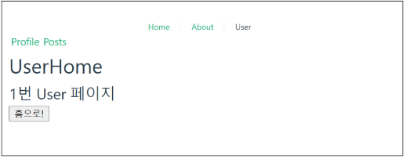

- UserView 컴포넌트에서 HomeView 컴포넌트로 이동하는 버튼 만들기

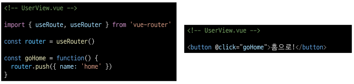

### router.replace()

- 현재 위치 바꾸기 (Replace current location)

- push 메서드와 달리 history stack에 새로운 항목을 push 하지 않고 다른 URL로 이동 (=== 이동 전 URL로 뒤로 가기 불가)

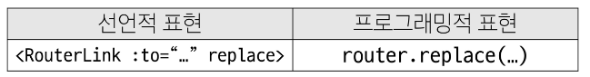

### router.replace 활용

- UserView 컴포넌트에서 HomeView 컴포넌트로 이동하는 버튼 만들기

### [참고] router.push의 인자 활용

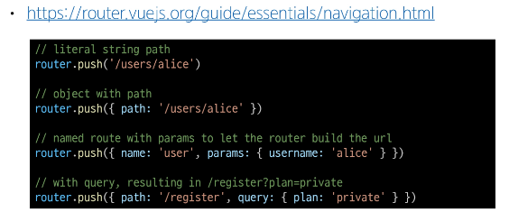

# route와 router

## route

### useRoute()

- 현재 활성화된 "경로 정보(route)를 담은 route 객체를 반환"

### route 객체 특징

- 읽기 전용
  - 현재 URL, 파라미터, 쿼리, name, matched 된 라우트 정보 등을 담고 있음

- 반응형
  - URL이 변경되면 route 객체도 자동으로 변경됨
  - 예) route.params.id를 참조하고 있다면, URL이 바뀌어 id가 변경될 때 해당 값이 자동으로 반영됨

### route 객체 역할

- 현재 경로에 대한 정보 확인
  - 경로 파라미터(route.params), 쿼리(route.query), name(route.name)등을 통해 현재 페이지가 어떤 상태인지 알 수 있음
- 하지만 route 객체 자체를 통해 페이지 이동(네비게이션)을 직접 제어 할 수는 없음

- > useRoute()는 "현재 URL 상태를 읽기 위한 객체(route)"를 제공하는 것

## router

### useRouter()

- 라우터 인스턴스 router 객체를 반환

### router 객체 특징

- 애플리케이션 전체 라우팅 로직을 제어할 수 있는 핵심 객체
- 페이지 이동, 네비게이션 관련 메거드 제공
  - router.push('/some-path'), router.replace('/another-path')등을 통해 프로그래밍적으로 라우트를 변경할 수 있음
- 네비게이션 가드 등록, 히스토리 제어 같은 기능 사용 가능

### router 객체 역할

- 프로그램적으로 경로 변경(리다이렉트), 뒤로 가기, 앞으로 가기
- 새로운 라우트 추가, 라우트 변경 등 다양한 라우팅 관련 동작 제어

- > useRouter()는 "라우터 전체 제어를 담당하는 객체(router)"를 제공하며 push, replace 등의 메서드를 사용하여 경로 이동을 실행할 수 있음

### route와 router 정리

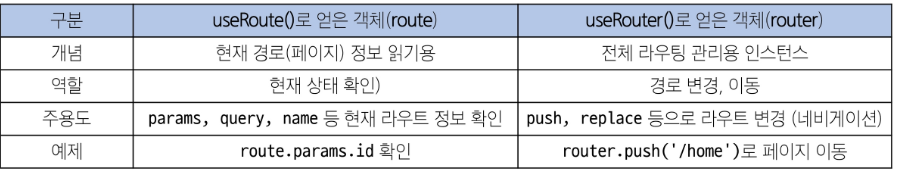

- useRoute()
  - 현재 라우트 "상태"를 읽어오는 전용 객체
- useRoute()
  - 라우팅 로직 "제어" 및 페이지 이동을 담당하는 인스턴스

# Navigation Guard

## 개요

### Navigation Guard

- Vue router를 통해 특정 URL에 접근할 때 다른 URL로 redirect를 하거나 취소하여 내비게이션을 보호

- > 라우트 전환 전/후 자동으로 실행되는 Hook

### Navigation Guard 종류

1. Globally (전역 가드)
   1. 애플리케이션 전역에서 모든 라우트 전환에 적용되는 가드
2. Per-route (라우터 가드)
   1. 특정 라우트에만 적용되는 가드
3. In-component(컴포넌트 가드)
   1. 컴포넌트 내에서만 적용되는 가드

## Globally Guard

### Globally Guard

- 애플리케이션 전역에서 동작하는 가드
- > 작성위치 : index.js

### Globally Guard 종류

- beforeEach()
- beforeResolve()
- afterEach()

### router.beforeEach()

- 다른 URL로 이동하기 직전에 실행되는 함수 (Global Before Guards)

### router.beforeEach 구조

- 모든 가드의 콜백 함수는 2개의 인자를 받음
  - to : 이동 할 URL 정보가 담긴 Route 객체
  - from : 현재 URL 정보가 담긴 Route 객체

- 선택적으로 다음 값 중 하나를 반환
    1. false
       1. 현재 내비게이션을 취소
       2. 브라우저 URL이 변경된 경우 (사용자가 수동으로 또는 뒤로가기 버튼을 통해) 'from' 경로의 URL로 재설정
    2. Route Location
       1. router.push()를 호출하는 것처럼 경로 위치를 전달하여 다른 위치로 redirect
       2. return이 없다면 자동으로 'to' URL Route 객체로 이동
  
### router.befroeEach 예시

1. 전역 가드 beforeEach 작성
2. HomeView에서 UserView로 이동 했을 때 각 인자 값 출력 확인하기

- Home에서 User로 이동해보기
- > to에는 이동할 URL인 user 라우트에 대한 정보가, from에는 현재 URL인 home 라우트에 대한 정보가 들어있음

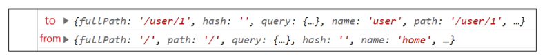

### router.beforeEach 활용

- "Login이 되어있지 않다면 페이지 진입을 막고 Login 페이지로 이동시키기"
- LoginView 컴포넌트 작성 및 라우트 등록

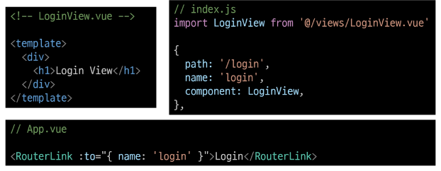

- 어떤 RouterLink를 클릭해도 LoginView 컴포넌트만 볼 수 있음

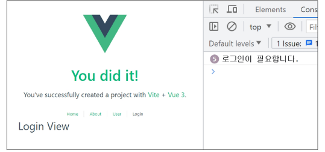

- 만약 로그인이 되어있지 않고(1), 이동하는 주소 이름이 login이 아니라면(2), login 페이지로 redirect

## Per-route Guard

### Per-route Guard

- 특정 라우터에서만 동작하는 가드

- > 작성위치: index.js의 각 routes

### Per-route Guard 종류

- beforeEnter()

### router.berforeEnter()

- 특정 route에 진입했을 때만 실행되는 함수

- > 단순히 URL의 매개변수나 쿼리 값이 변경될 때는 실행되지 않고, 다른 URL에서 탐색해 올 때만 실행됨

### router.beforeEnter 구조

- routes 객체에서 정의

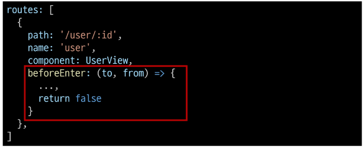

1. 라우터 가드 beforeEnter 작성
2. HomeView에서 LoginView로 이동 후 각 인자 값 출력 확인하기

### router.beforeEnter 예시

- to에는 이동할 URL인 login 라우트에 대한 정보가, from에는 현재 URL인 home 라우트에 대한 정보가 들어있음
- 다른 경로에서 login 라우트를 탐색 했을 때 실행된 것

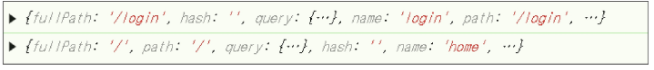

### router.beforeEnter 활용

- "이미 로그인 한 상태라면 LoginView 진입을 막고 HomeView로 이동 시키기"

- > 전역 가드 beforeEach 관련 코드는 주석 처리 후 진행

- 로그인 상태라면 HomeView로 이동

- 로그인 상태가 아니라면 LoginView로 이동

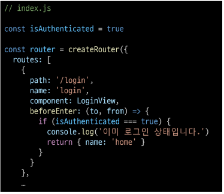

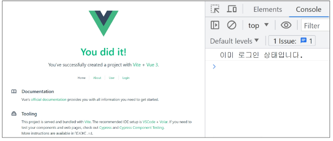

## In-component Guard

### In-component Guard

- 특정 컴포넌트 내에서만 동작하는 가드

- > 작성위치: 각 컴포넌트의 <script> 내부

### In-component Guard 종류

- onBeforeRouteLeave()
  - 현재 라우트에서 다른 라우트로 이동하기 전에 실행
  - > 사용자가 현재 페이지를 떠나는 동작에 대한 로직을 처리

- onBeforeRouteUpdate()
  - 이미 렌더링 된 컴포넌트가 같은 라우트 내에서 업데이트 되기 전에 실행
  - > 라우트 업데이트 시 추가적인 로직을 처리

### OnBeforeRouteLeave 활용

- "사용자가 UserView를 떠날 시 팝업 창 출력하기"

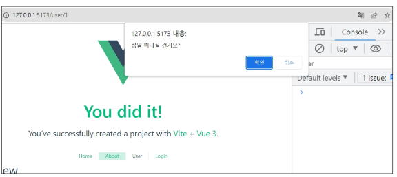

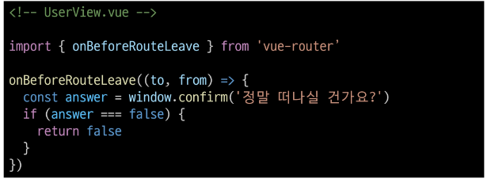

### OnBeforeRouteUpdate 활용

- "UserView 페이지에서 다른 id를 가진 User의 UserView 페이지로 이동하기"
- > 같은 라우트 내에서 업데이트 되는 경우 (/user/1 -> /user/100)
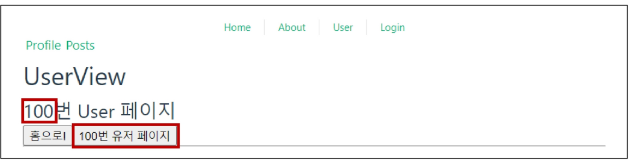

### 만약 onBeforeRouteUpdate를 사용하지 않았다면?

- onBeforeRouteUpdate에서 userId를 변경하지 않으면 userId는 갱신되지 않음
- > 컴포넌트가 재사용 되었기 때문

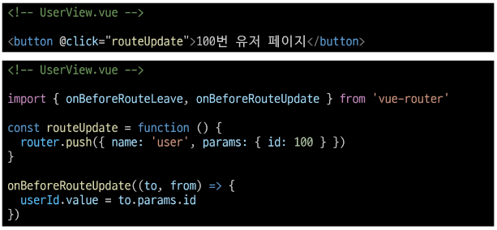

### Navigation Guard 정리

1. Globally (전역 가드)
   1. 애플리케이션 전역에서 동작
   2. 작성위치: index.js
2. Per-route (라우터 가드)
   1. 특정 route에서만 동작
   2. 작성위치: index.js의 각 routes
3. In-component (컴포넌트 가드)
   1. 특정 컴포넌트 내에서만 동작
   2. 작성위치: 각 컴포넌트의 script

# <참고>

### Lazy Loading Routes

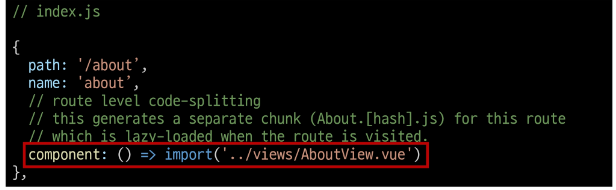

- Vue 애플리케이션 첫 빌드 시 해당 컴포넌트를 로드 하지 않고, "해당 경로를 처음으로 방문할 때 컴포넌트를 로드" 하는 것
- > 앱을 빌드할 때 처음부터 모든 컴포넌트를 준비하면 컴포넌트의 크기에 따라 페이지 로드 시간이 길어질 수 있기 때문