# 프로젝트 개요

### 앞으로 수업에서 진행할 ㅍ,로젝트

1. Vue와 DRF 간 기본적인 요청과 응답
2. Vue와 DRF에서의 인증 시스템
3. User 커스터마이징

## DRF 프로젝트 안내

### DRF 프로젝트 안내

- 스켈레톤 프로젝트 django-pjt 제공
- 외부 패키지 및 라이브러리는 requirements.txt에 작성되어 있음
- > DRF 프로젝트는 "주석을 해제"하며 진행

### Skeleton code 살펴보기

- Model 클래스 확인
  
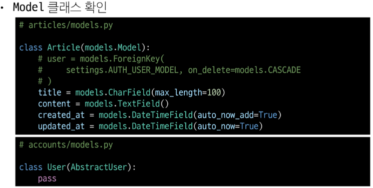

- URL 확인

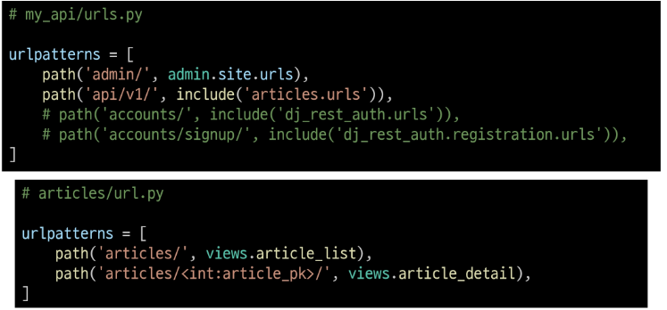

- Serializers 확인

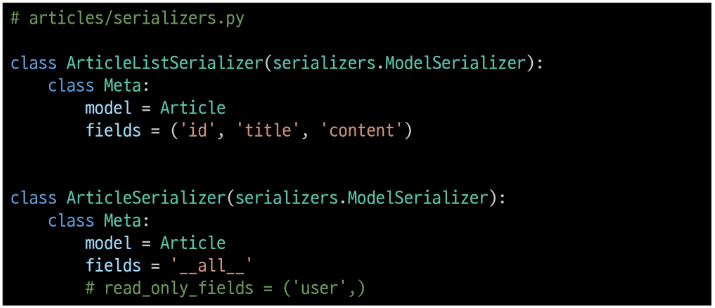

- views.py의 import 부분 확인

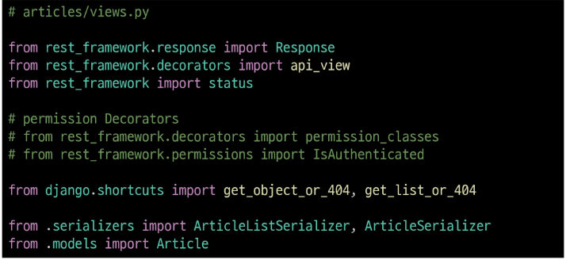

- View 함수 확인

- settings.py 확인

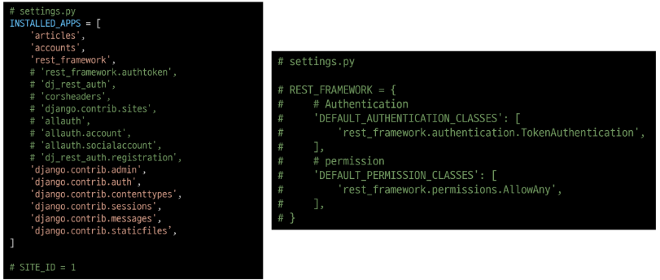

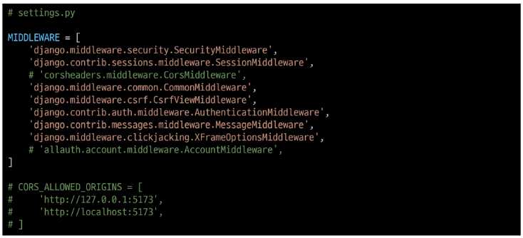

- Fixtures 확인

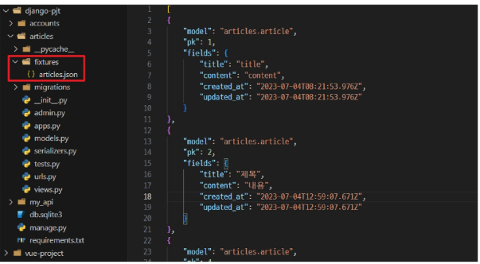

- 가상 환경 생성 및 활성화

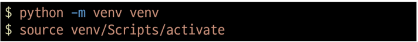

- 패키지 설치

- Migration 진행

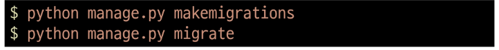

- Fixtures 데이터 로드

- Django 서버 실행 후, 전체 게시글 조회 요청

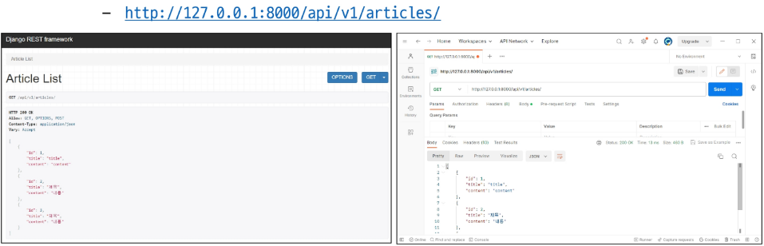

## Vue 프로젝트 안내

### Vue 프로젝트 안내

- 스켈레톤 프로젝트 vue-pjt 제공
- Vite를 사용해 Pinia 및 Vue Router가 추가 되어있음
- pinia-plugin-persistedstate가 설치 및 등록 되어있음
- Vue 프로젝트는 "직접 코드를 작성"하며 진행
- 컴포넌트 구조

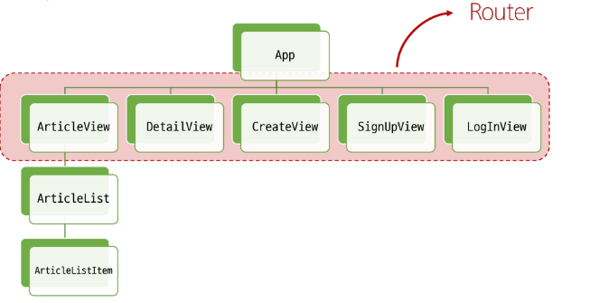

- 프로젝트 구조

### Skeleton code 살펴보기

- App 컴포넌트

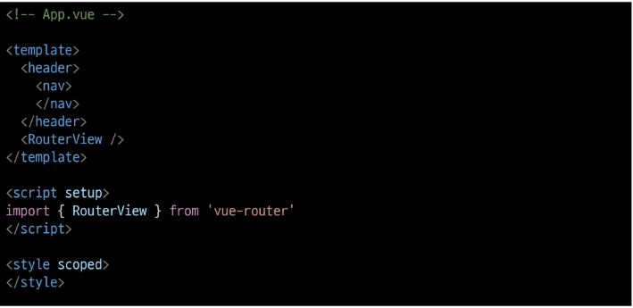

- route에 등록된 컴포넌트 (Article, Create, Detail, LogIn, SignUp)

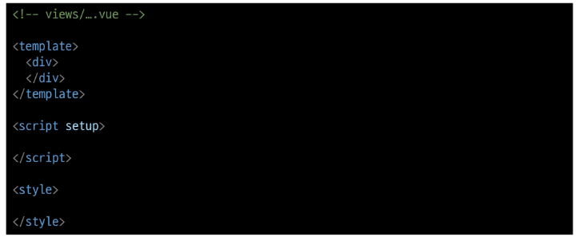

- ArticleList 컴포넌트

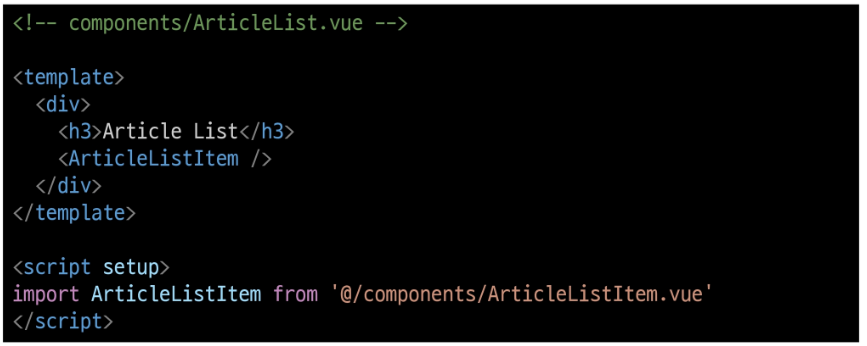

- ArticleListItem 컴포넌트

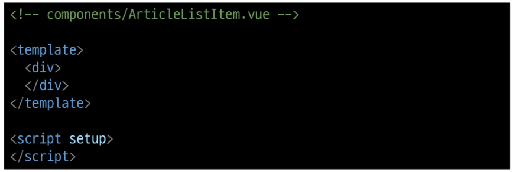

- routes 현황

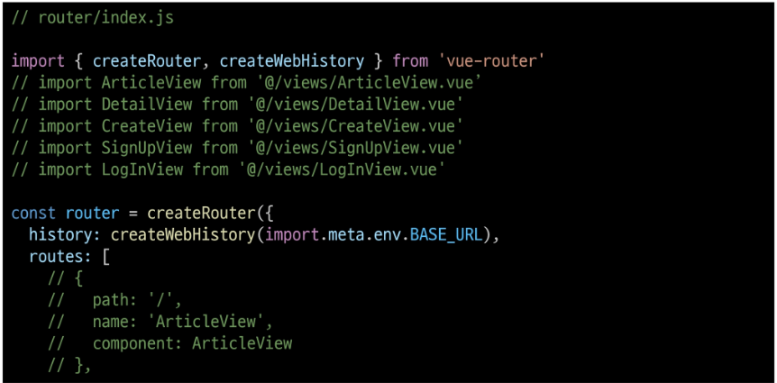

- store 현황

- main.js 현황

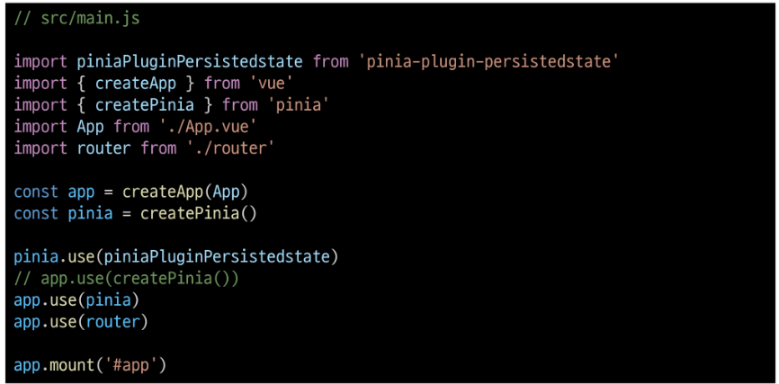

- 패키지 설치

- 서버 실행

# 메인 페이지 구현

### 시작하기 전에..

- 무결점의 프로젝트를 만드는 것이 아님
- frontend 프레임워크와 backend 프레임워크 간의 요청과 응답, 그 과정에서 등장하는 새로운 개념과 문제를 해결하면서 하나의 웹 애플리케이션 서비스를 구현하는 과정에 집중할 것

## 게시글 목록 출력

### 개요

- ArticleView 컴포넌트에 ArticleList 컴포넌트와 ArticleListItem 컴포넌트 등록 및 출력하기
- ArticleList와 ArticleListItem은 각각 게시글 출력을 담당

### 게시글 목록 출력

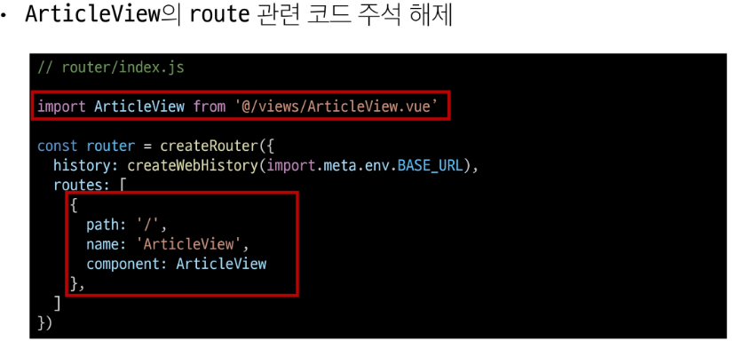

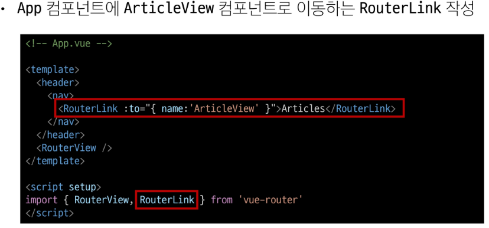

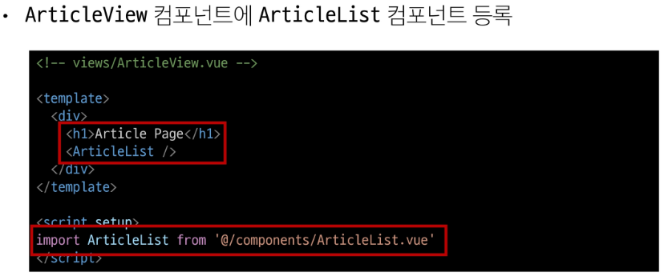

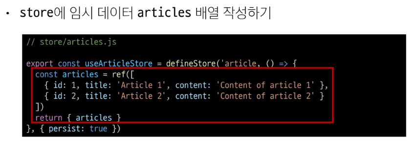

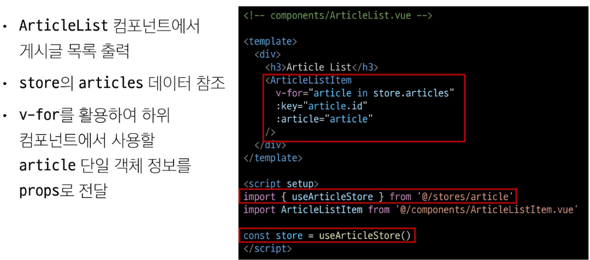

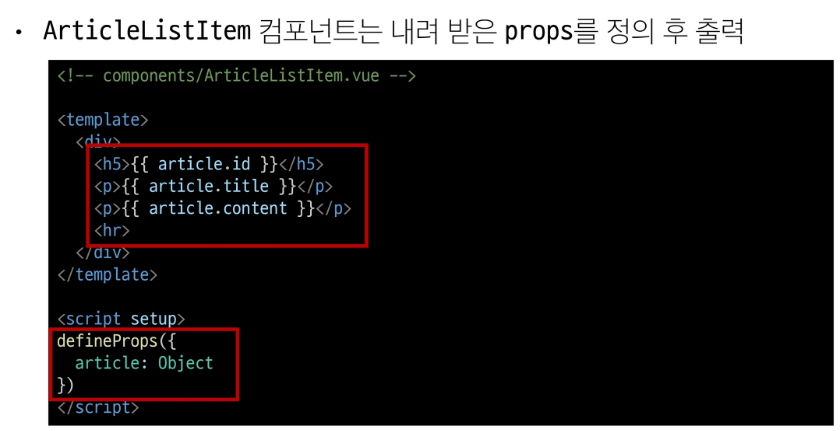

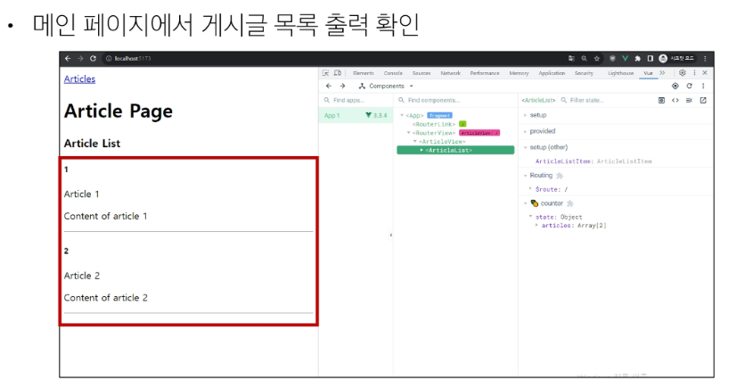

## DRF와의 요청과 응답

### DRF로 부터 응답 데이터 받기

- 이제는 임시 데이터가 아닌 DRF 서버에 요청하여 데이터를 응답 받아 store에 저장 후 출력하기

### DRF와의 요청과 응답

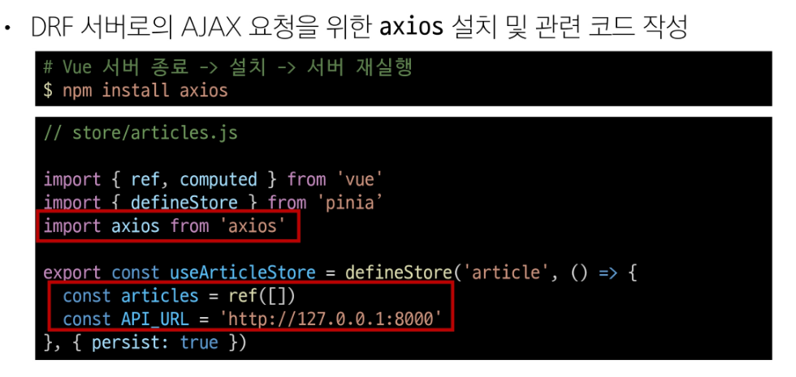

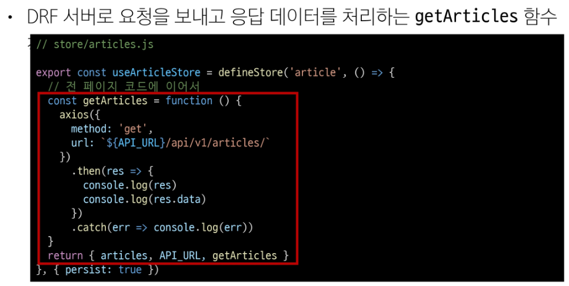

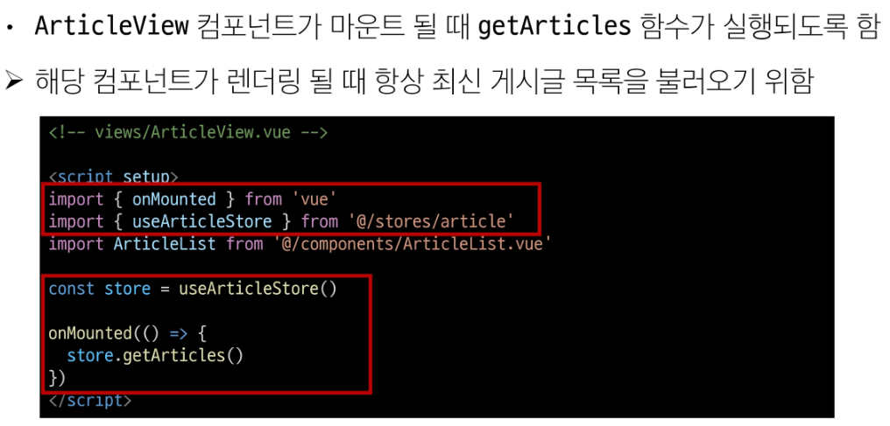

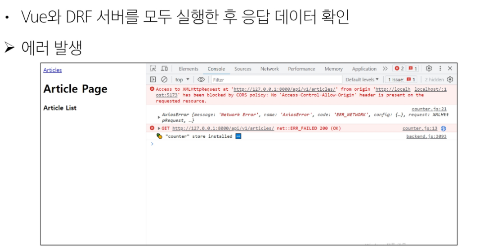

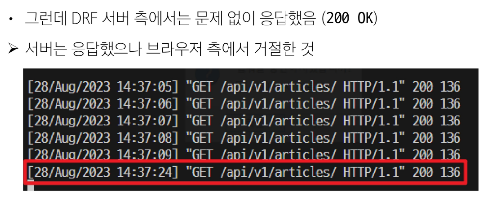

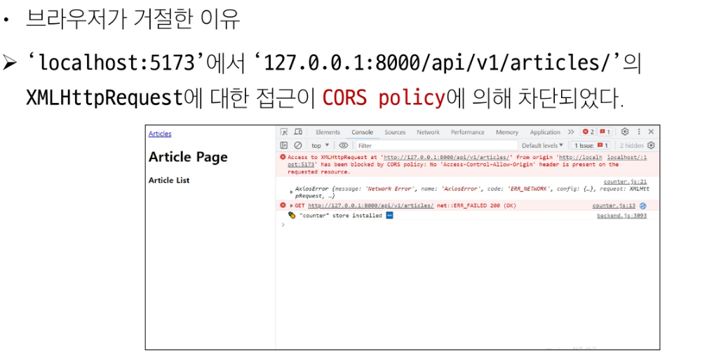

# CORS Policy

## CORS Policy

### SOP(Same-origin policy)

- 동일 출처 정책

### SOP

- 어떤 출처(Origin)에서 불러온 문서나 스크립트가 다른 출처에서 가져온 리소스와 상호 작용하는 것을 제한하는 보안 방식

- > "다른 곳에서 가져온 자료는 일단 막는다"
- > 웹 애플리케이션의 도메인이 다른 도메인의 리소스에 접근하는 것을 제어하여 사용자의 개인 정보와 데이터의 보안을 보호하고, 잠재적인 보안 위협을 방지
- > 잠재적으로 해로울 수 있는 문서를 분리함으로써 공격받을 수 있는 경로를 줄임

### Origin(출처)

- URL의 Protocol, Host, Port를 모두 포함하여 "출처"라고 부름
- Same Origin 예시
  - 아래 세 영역이 일치하는 경우에만 동일 출처(Same-origin)로 인정

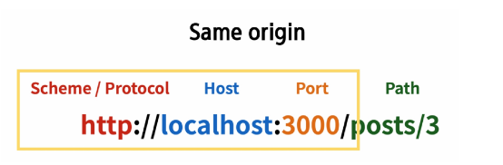

- Same Origin 예시
  http://localhost:3000/articles/3/을 기준으로 동일 출처 여부를 비교

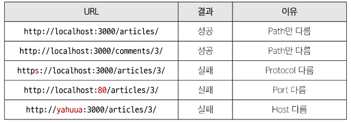

### CORS policy의 등장

- 기본적으로 웹 브라우저는 같은 출처에서만 요청하는 것을 허용하며, 다른 출처로의 요청은 보안상의 이유로 차단됨
  - SOP에 의해 다른 출처의 리소스와 상호작용 하는 것이 기본적으로 제한되기 때문
  
- 하지만 현대 웹 애플리케이션은 다양한 출처로부터 리소스를 요청하는 경우가 많기 때문에 CORS 정책이 필요하게 되었음

- > CORS는 웹 서버가 리소스에 대한 서로 다른 출처 간 접근을 허용하도록 선택할 수 있는 기능을 제공

### CORS (Croos-Origin Resource Sharing)

- 교차 출처 리소스 공유

### CORS 

- 특정 출처에서 실행 중인 웹 애플리케이션이 다른 출처의 자원에 접근할 수 있는 권한을 부여하도록 브라우저에 알려주는 체제

- > 만약 다른 출처의 리소스를 가져오기 위해서는 이를 제공하는 서버가 브라우저에게 다른 출처지만 접근해도 된다는 사실을 알려야 함
- > "CORS policy (교차 출처 리소스 공유 정책)"

### CORS Policy (Cross-Origin Resource Sharing Policy)

- 교차 출처 리소스 공유 정책

### CORS Policy

- 다른 출처에서 온 리소스를 공유하는 것에 대한 정책
- 서버에서 설정되며, 브라우저가 해당 정책을 확인하여 요청이 허용되는지 여부를 결정

- > 다른 출처의 리소스를 불러오려면 그 다른 출처에서 올바른 CORS header를 포함한 응답을 반환해야 함

### CORS 적용 방법

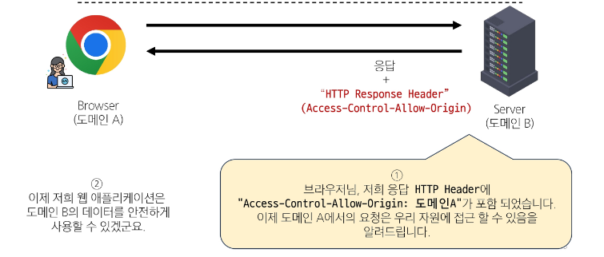

### CORS Policy 정리

- 웹 애플리케이션이 다른 도메인에 있는 리소스에 안전하게 접근할 수 있도록 허용 또는 차단하는 보안 메커니즘
- 서버가 약속된 CORS Header를 포함하여 응답한다면 브라우저는 해당 요청을 허용
- > 서버에서 CORS Header를 만들어야 한다.

## CORS Headers 설정

### CORS Headers 설정하기

- Django에서는 django-cors-headers 라이브러리 활용

- > 손쉽게 응답 객체에 CORS header를 추가해주는 라이브러리

### django-cors-headers 사용하기

- 설치 (requirements.txt로 인해 사전에 설치되어 있음)

- 관련 코드 주석 해제

- CORS를 허용할 Vue 프로젝트의 Domain 등록

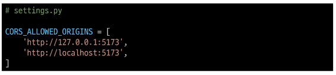

### CORS 처리 결과

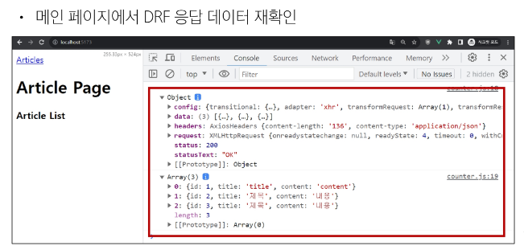

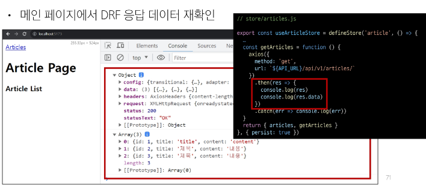

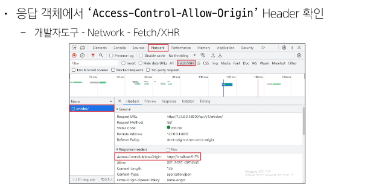

# Article CR 구현

## 전체 게시글 조회

### 전체 게시글 목록 저장 및 출력

- 응답 받은 데이터에서 각 게시글의 데이터 구성 확인 (id, title, content)

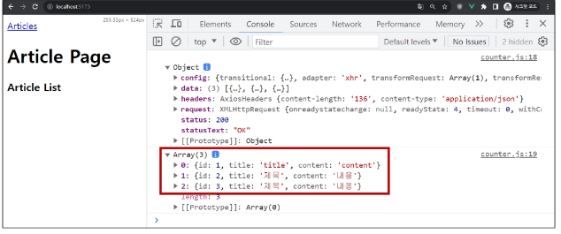

- store에 게시글 목록 데이터 저장

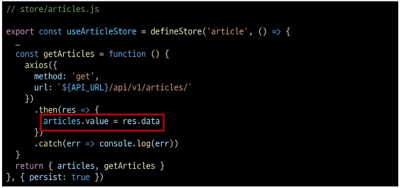

- store에 저장된 게시글 목록 출력 확인
  - pinia-plugin-persistedstate에 의해 브라우저 Local Storage에 저장됨

  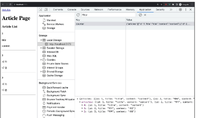

## 단일 게시글 조회

### 단일 게시글 데이터 출력

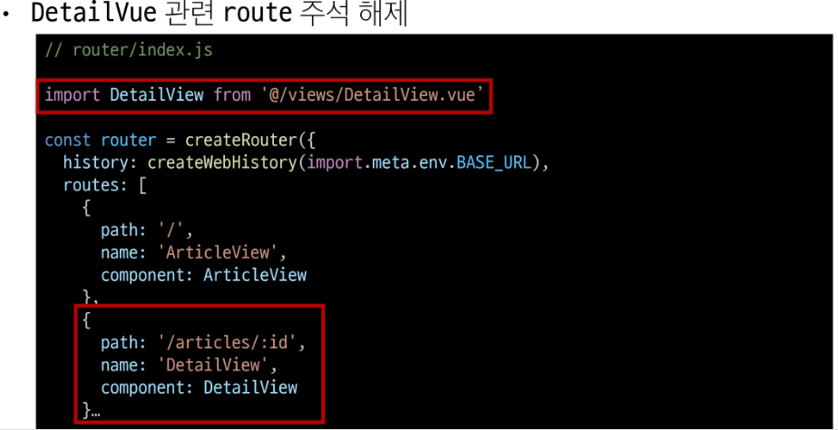

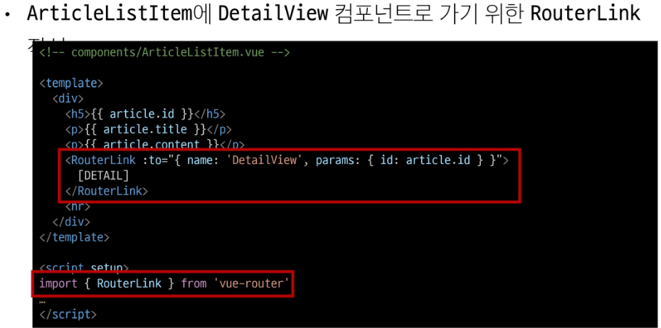

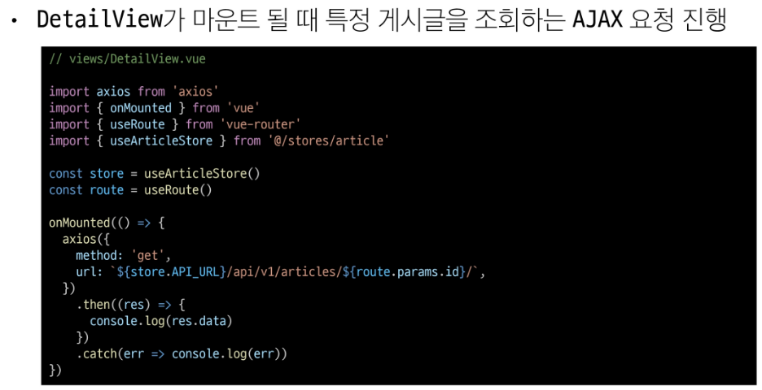

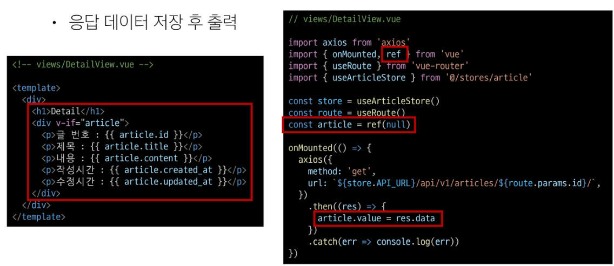

## 게시글 작성

### 게시글 작성

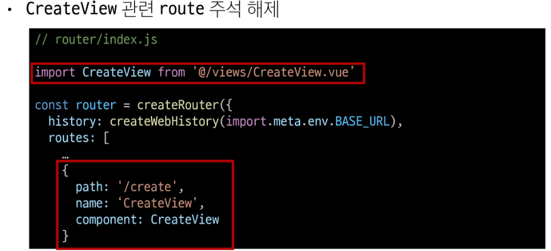

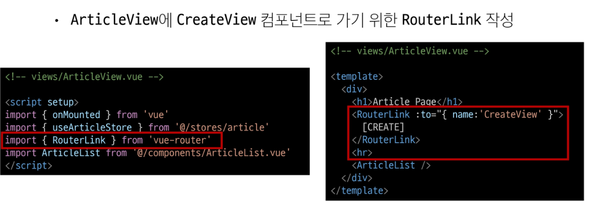

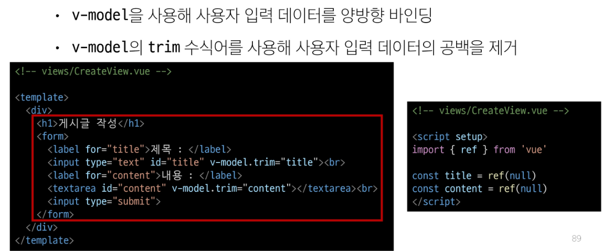

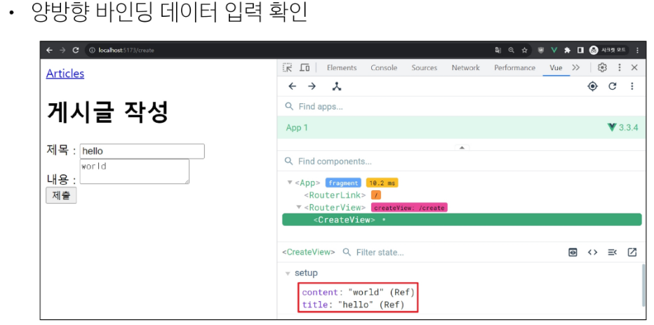

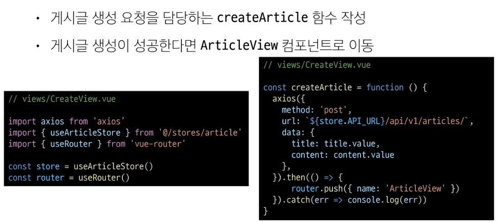

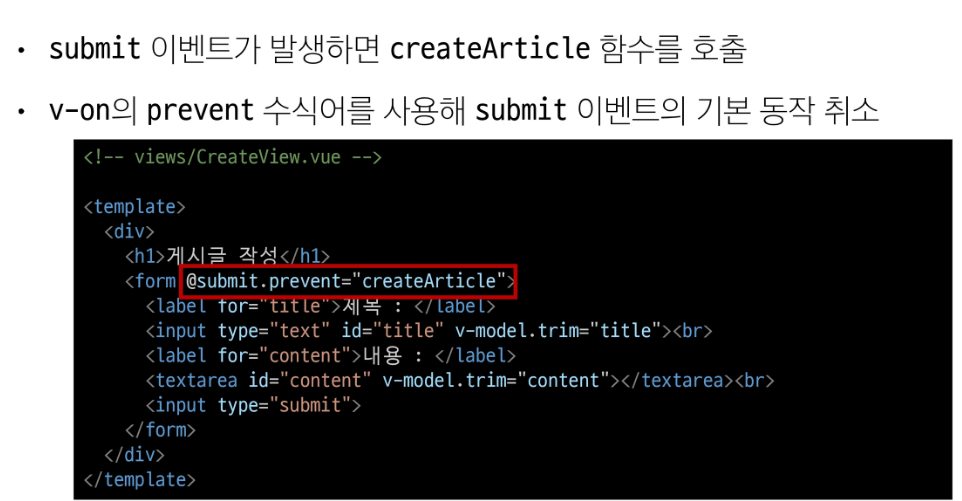

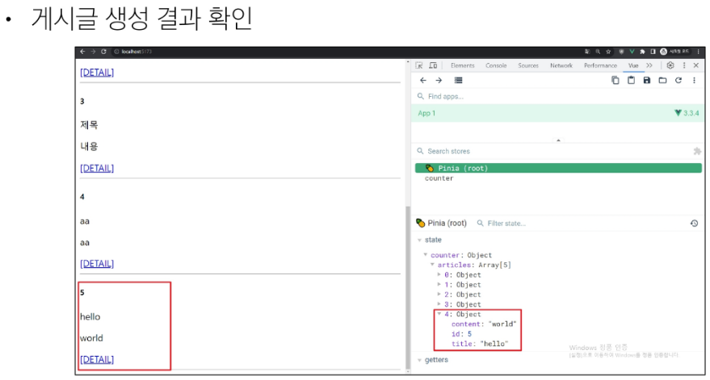

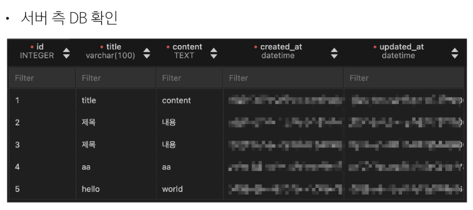