# 인증 with DRF

## 개요

### 시작하기 전에

- 인증 로직 진행을 위해 User 모델 관련 코드 활성화
- user ForeignKey 주석 해제

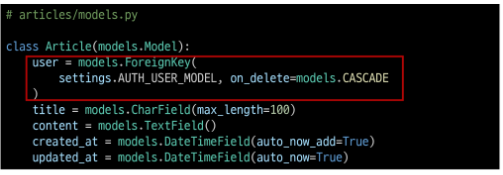

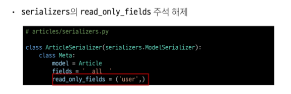

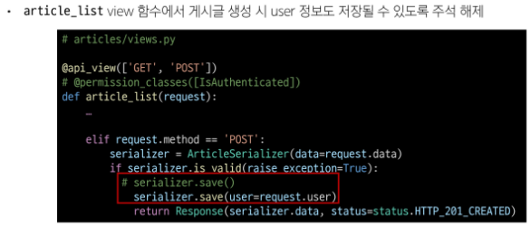

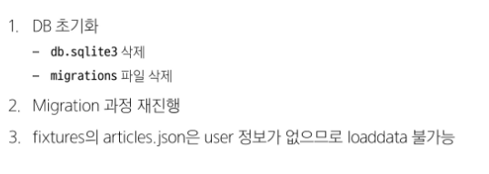

## 인증

### Authenrication(인증)

- 수신된 요청을 해당 요청의 사용자 또는 자격 증명과 연결하는 메커니즘
- > 누구인지를 확인하는 과정

### Permissions(권한)

- 요청에 대한 접근 허용 또는 거부 여부를 결정

### 인증과 권한

- 순서상 인증이 먼저 진행되며 수신 요청을 해당 요청의 사용자 또는 해당 요청이 서명된 토큰(token)과 같은 자격 증명 자료와 연결
- 그런 다음 권한 및 제한 정책은 인증이 완료된 해당 자격 증명을 사용하여 요청을 허용해야 하는 지를 결정

### DRF에서의 인증

- 인증은 항상 view 함수 시작 시, 권한 및 제한 확인이 발생하기 전, 다른 코드의 진행이 허용되기 전에 실행됨

- * 인증 자체로는 들어오는 요청을 허용하거나 거부할 수 없으며, 단순히 요청에 사용된 자격 증명망 식별한다는 점에 유의

### 승인되지 않은 응답 및 금지된 응답

-  인증되지 않은 요청이 권한을 거부하는 경우 해당되는 두 가지 오류 코드를 응답
  
1. HTTP 401 Unauthorized
   1. 요청된 리소스에 대한 유효한 인증 자격 증명이 없기 때문에 클라이언트 요청이 완료되지 않았음을 나타냄 (누구인지를 증명할 자료가 없음)
2. HTTP 403 Forbidden (Permission Denied)
   1. 서버에 요청이 전달되었지만, 권한 때문에 거절되었다는 것을 의미
   2. 401과 다른 점은 서버는 클라이언트가 누구인지 알고 있음

## 인증 정책 설정

### 인증 정책 설정 방법 2가지

1. 전역 설정
2. View 함수 별 설정

### 1. 전역 설정

- 프로젝트 전체에 적용되는 기본 인증 방식을 정의
- DEFAULT_AUTHENTICATION_CLASSES를 사용
- 기본 값 : SessionAuthentication과 BasicAuthentication
- 사용 예시 (DRF 공식 문서 참고)

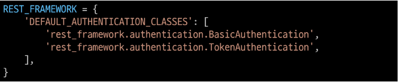

### 2. View 함수 별 설정

- authentication_classes 데코레이터를 사용
- 개별 view에 지정하여 재정의
- 사용 예시(DRF 공식 문서 참고)

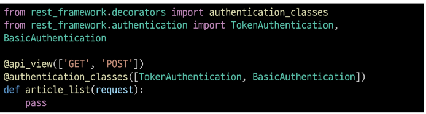

### DRF가 제공하는 인증 체계

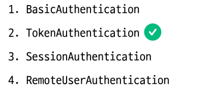

### TokenAuthentication

- token 기반 HTTP 인증 체계
- 기본 데스크톱 및 모바일 클라이언트와 같은 클라이언트-서버 설정에 적합

- > 서버가 인증된 사용자에게 토큰을 발급하고 사용자는 매 요청마다 발급받은 토큰을 요청과 함께 보낸 인증 과정을 거침

## Token 인증 설정

### TokenAuthentication 적용 과정

1. 인증 클래스 설정
2. INSTALLED_APPS 추가
3. Migrate 진행

### 1. 인증 클래스 설정

- TokenAuthentication 활성화 코드 주석 해제
- > 전역 인증 정책을 Token 방식으로 설정

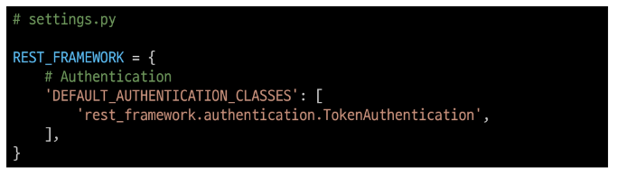

### 2. INSTALLED_APPS 추가

- rest_framework.authtoken 주석 해제

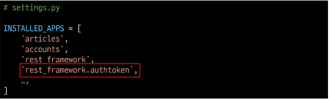

### 3. Migrate 진행

- Migrate

### 토큰 인증 방식 과정

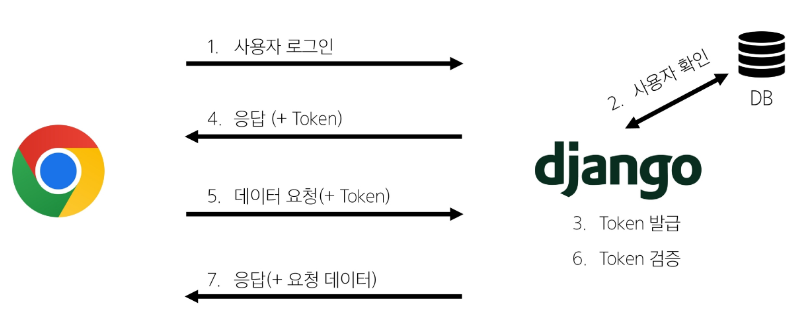

## Dj-Rest-Auth 라이브러리

### Dj-Rest-Auth

- 회원가입, 인증(소셜미디어 인증 등), 비밀번호 재설정, 사용자 세부 정보 검색, 회원 정보 수정 등 다양한 인증 관련 기능을 제공하는 라이브러리

### Dj-Rest-Auth 설치 및 적용

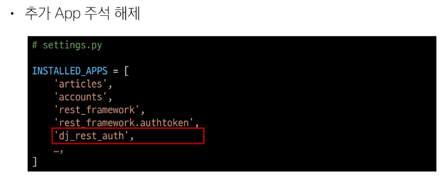

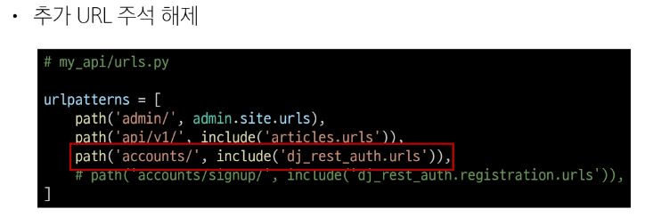

### Dj-Rest-Auth의 Registration(등록) 기능 추가 설정

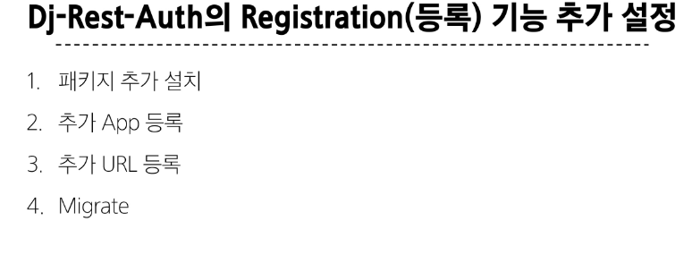

### Registration 기능 추가

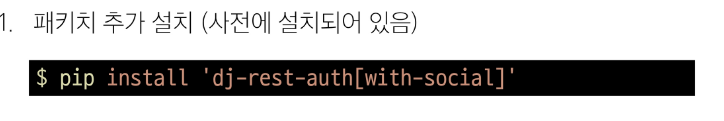

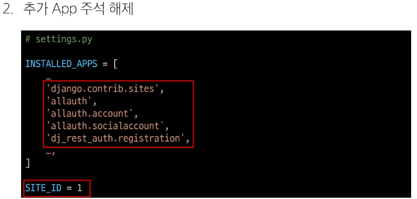

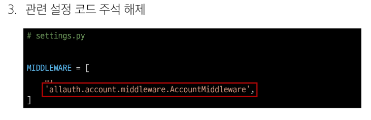

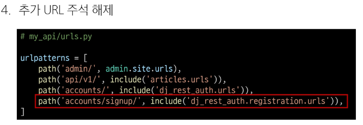

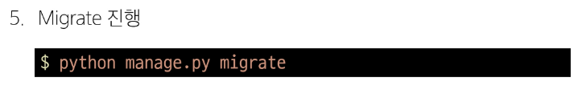

## Token 발급 및 활용

### Token 발급

- 회원 가입 및 로그인을 진행하여 토큰 발급 테스트하기

- 라이브러리 설치로 인해 추가 된 URL 목록 확인
  - http://127.0.0.1:8000/accounts/

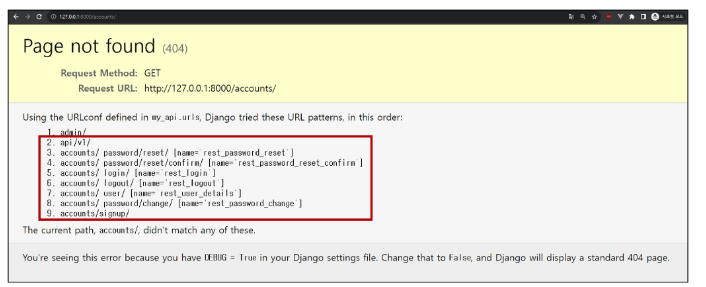

- 회원 가입 진행 (DRF 페이지 하단 회원 가입 form 사용)
  - http://127.0.0.1:8000/accounts/signup/

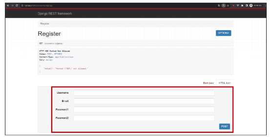

- 로그인 진행 (DRF 페이지 하단 로그인 form 사용)
  - http://127.0.0.1:8000/accounts/login/
  
  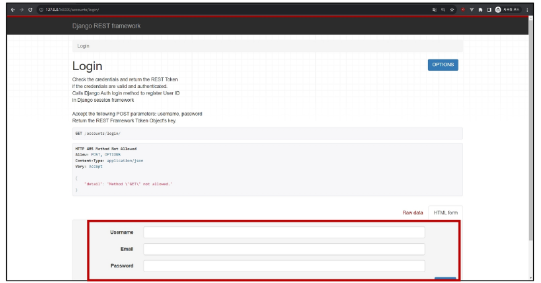

- 로그인 성공 후 DRF로 부터 발급 받은 Token 확인
- > 이제 이 Token을 Vue에서 별도로 저장하여 매 요청마다 함께 보내야 함

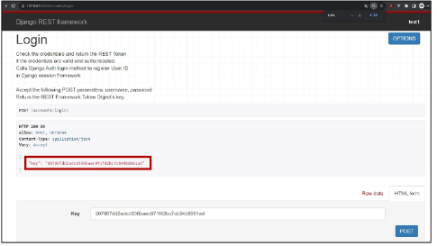

### Token 활용

- 게시글 작성 과정을 통해 Token 사용 방법 익히기
- Postman을 활용해 게시글 작성 요청
  - http://127.0.0.1:8000/api/v1/articles/

- Body에 게시글 제목과 내용 입력
  - http://127.0.0.1:8000/api/v1/articles/

  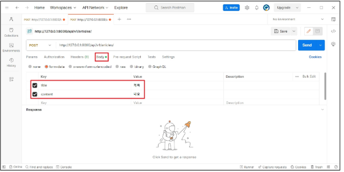

- Headers에 발급받은 Token 작성 후 요청 성공 확인
  - Key: "Authorization"
  - Value: "Token 토큰 값"
  
  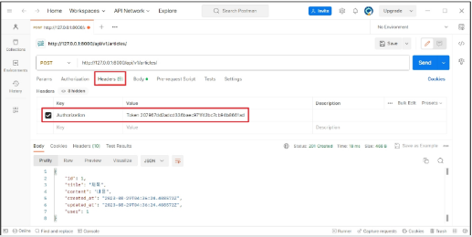

### 클라이언트가 Token으로 인증 받는 방법

1. "Authorization" HTTP Header에 포함
2. 키 앞에는 문자열 "Token"이 와야 하며 "공백"으로 두 문자열을 구분해야 함

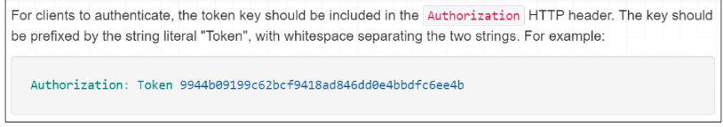

### Token 데이터 확인

- Django DB확인

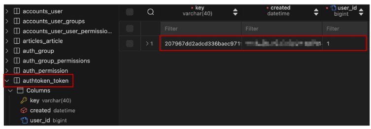

### 발급 받은 Token을 인증이 필요한 요청마다 함께 보내야 함

# 권한 with DRF

## 권한 정책 설정

### 권한 설정 방법

1. 전역 설정
2. View 함수 별 설정

### 1. 전역 설정

- 프로젝트 전체에 적용되는 기본 권한 방식을 정의
- DEFAULT_PERMISSION_CLASSES를 사용
- 기본 값 : rest_framework.permissions.AllowAny
- 사용 예시(DRF 공식 문서 참고)
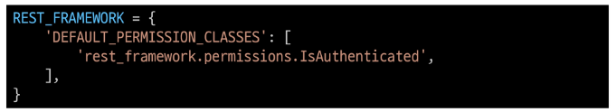

### View 함수 별 설정

- permission_classes 데코레이터를 사용
- 개별 view에 지정하여 재정의
- 사용 예시 (DRF 공식 문서 참고)

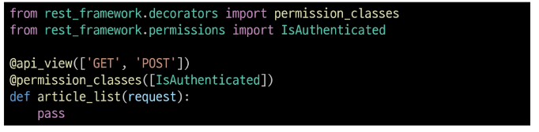

### DRF가 제공하는 권한 정책

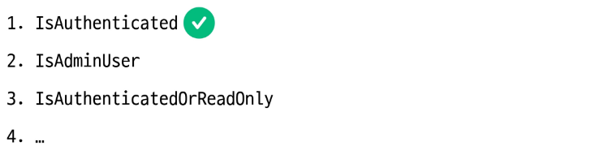

### IsAuthenticated

- 개념
  - 인증된 사용자만 접근을 허용하는 권한 클래스
  - 인증되지 않은 사용자의 모든 요청을 거부
- 특징
  - request.user가 존재하고 인증된 상태인지 확인
  - 보호해야 할 중요한 데이터나 리소스에 적합(예: 회원 전용 페이지, 결제, 프로필 수정 등)

### AllowAny

- 개념
  - 모든 요청을 무조건 허용하는 권한 클래스
  - 인증된 사용자든, 인증되지 않은 사용자든 상관없이 모두에게 접근을 허용
- 특징
  - 권한 검사(Authorization) 로직을 전혀 수행하지 않음
  - API 엔드포인트를 완전히 공개하고 싶을 때 사용
  - 보안이 필요한 리소스에는 부적합하므로, 회원가입, 로그인 또는 공개 게시글 조회 등 공개 API에 주로 적용

## IsAuthenticated 설정

### IsAuthenticated 권한 설정

- DEFAULT_PERMISSION_CLASSES 주석 해제
- > 기본적으로 모든 View 함수에 대한 접근을 허용

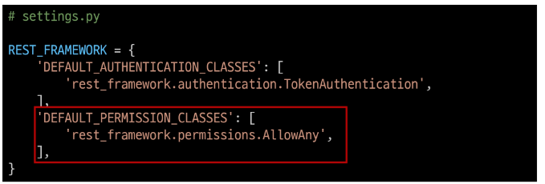

- permission_classes 관련 코드 주석 해제
- > 전체 게시글 조회 및 생성시에만 인증된 사용자만 진행 할 수 있도록 권한 설정

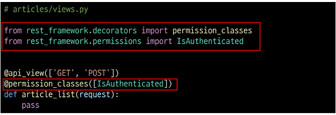

### 권한 활용

- 만약 관리자만 전체 게시글 조회가 가능한 권한이 설정 되었을 때, 인증된 일반 사용자가 조회 요청을 할 경우 어떻게 되는지 응답 확인하기
- 테스트를 위해 임시로 관리자 관련 권한 클래스 IsAdminUser로 변경

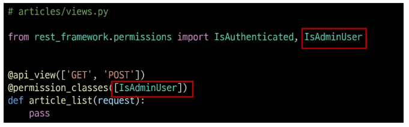

- 전체 게시글 조회 요청
  - http://127.0.0.1:8000/api/v1/articles/
- 403 Forbidden / 401 Unauthorized(Token 비활성화 후) 응답 확인

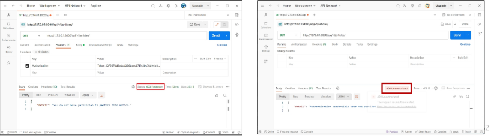

- IsAdminUser 삭제 후 IsAuthenticated 권한으로 복구

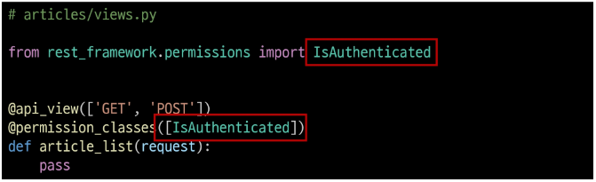