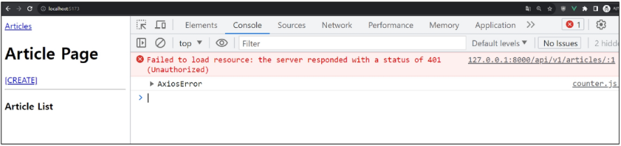
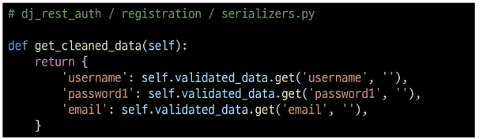

# 인증 with Vue

### 시작하기 전에

1. DB 초기화
   1. db.sqlite3 삭제
2. Migration 과정 재 진행
3. 관리자 계정 생성 후, 게시글 1개 이상 작성
   1. 기존 fixtures 데이터는 user 정보가 없으므로 사용 불가능.

- 정상 작동하던 게시글 전체 조회가 작동하지 않음
  - 401 status code 확인

- > 게시글 조회 요청 시 인증에 필요한 수단(token)을 보내지 않고 있으므로 게시글 조회가 불가능해진 것

## 회원가입

### 회원가입 로직 구현

## 로그인

### 로그인 로직 구현

## 요청과 토큰

### Token을 store에 저장하여 인증이 필요한 요청마다 함께 보낸다.

### 토큰 저장 로직 구현

### 토큰이 필요한 요청

1. 게시글 전체 목록 조회 시
2. 게시글 작성 시

### 게시글 전체 목록 조회 with token

- 게시글 전체 목록 조회 요청 함수 getArticles에 token 추가

- 401 상태 코드가 사라지고 게시글이 정상적으로 출력되는 것을 확인

### 게시글 생성 with token

- 게시글 생성 요청 함수 createArticle에 token 추가

- 게시글 작성 확인
- 

## 인증 여부 확인

### 사용자의 인증(로그인) 여부에 따른 추가 기능 구현

1. 인증 되지 않은 사용자
   1. >메인 페이지 접근 제한
2. 인증된 사용자
   1. > 회원가입 및 로그인 페이지에 접근 제한

### 인증 상태 여부를 나타낼 속성 값 지정

- token 소유 여부에 따라 로그인 상태를 나타낼 isLogin 변수 작성
- 그리고 computed를 활용해 token 값이 변할 때만 상태를 계산하도록 함

### 1. 인증 되지 않은 사용자는 메인 페이지 접근 제한

- 전역 네비게이션 가드 beforeEach를 활요해 다른 주소에서 메인 페이지로 이동 시 인증 되지 않은 사용자라면 로그인 페이지로 이동시키기

- 브라우저 local storage에서 token을 삭제 후 메인 페이지 접속 시도

### 2. 인증 된 사용자는 회원가입과 로그인 페이지에 접근 제한

- 다른 주소에서 회원가입 또는 로그인 페이지로 이동 시 이미 인증 된 사용자라면 메인 페이지로 이동시키기

- 로그인 후 회원가입, 로그인 페이지 접속 시도

# User Customize

### 시작하기 전에

1. DB 초기화
   1. db.sqlite3 삭제
   
## user Customize

### 1. User Model에 필드 추가

- 사용자의 나이 정보를 저장 할 PositiveInteferField 추가

- makemigartions, migrate 작업 진행

- age 필드 추가 확인

### 2. Vue 회원 가입 기능 수정

- age 입력을 위한 input과 변수 및 payload data 수정

- singUp 함수에 age 정보 추가

### 회원 가입 성공 ?

- 회원가입 요청 후, 응답 결과 확인

- 요청 보낸 유저 명으로 잘 생성 되었으나, age 정보는 누락되었음

### RegisterSerializer

- dj-rest-auth의 RegisterSerializer의 field 정보 확인
- username, email, password1, password2 필드만 정의 되어 있음

## Customize RegisterSerializer

### 회원 가입 기능 수정

- CustomRegiserSerializer에 정의 (RegisterSerializer 상속)
- age 필드 추가 (필요하다면, first_name 등 기본 제공 필드 추가 가능)

- 유효성 검사를 위한 get_cleaned_data 함수 구조 확인
- 입력 받은 데이터의 유효성 검사 결과를 객체 형태로 반환 해야 함
- 새롭게 추가한 필드도 추가하여 동일하게 동작할 수 있도록 수정

- super()를 사용하여, 기존 필드에 대한 유효성 검사 실행 후,
- 추가 필드에 대해 동일한 작업을 진행한 결과를 반영하여 반환

- save 함수도 유효성 검사 함수와 같은 작업을 진행

- dj-rest-auth가 CustomRegisterSerializer을 사용하도록 설정
- REST_AUTH_REGISTER_SERIALIZER 주석 해제

### 회원 가입 요청 및 결과 확인

- 이전과 달리 정상적으로 age 정보가 기입된 것을 확인

# <참고>

## 로그아웃

### 로그아웃 구현

- logout 작성

- App 컴포넌트에 로그아웃 form 요소 작성

## 기타 기능 구현

### 자연스러운 흐름을 위한 기타 기능 구현

1. 로그인 성공 후 자동으로 메인 페이지로 이동하기
2. 회원가입 성공 후 자동으로 로그인까지 진행하기

### 1. 로그인 성공 후 자동으로 메인 페이지로 이동하기

### 2. 회원가입 성공 후 자동으로 로그인까지 진행하기

## Django Signals

### Django Signals

- "이벤트 알림 시스템"
- 애플리케이션 내에서 특정 이벤트가 발생할 때, 다른 부분에게 신호를 보내어 이벤트가 발생헀음을 알릴 수 있음
- 주로 모델의 데이터 변경 또는 저장, 삭제와 같은 작업에 반응하여 추가적인 로직을 실행하고자 할 때 사용
  - 예를 들어, 사용자가 새로운 게시글을 작성할 때마다 특정 작업 (예: 이메일 알림 보내기)을 수행하려는 경우

## 환경 변수

### 환경 변수(environment variable)

- 애플리케이션의 설정이나 동작을 제어하기 위해 사용되는 변수

### 환경 변수의 목적

- 개발, 테스트 및 프로덕션 환경에서 다르게 설정되어야 하는 설정 값이나 민감한 정보(ex. API KEY)를 포함
- 환경 변수를 사용하여 애플리케이션의 설정을 관리하면, 다양한 환경에서 일관된 동작을 유지하면서 필요에 따라 변수를 쉽게 변경할 수 있음
- 보안적인 이슈를 피하고, 애플리케이션을 다양한 환경에 대응하기 쉽게 만들어 줌

### Vite에서 환경변수를 사용하는 법

- .env.local 파일 생성 및 API 변수 작성
- 주의사항
  - 변수명은 반드시 VITE_접두어를 작성해야 함
  - 변수명과 값 사이에 공백이 없어야 함
  

## Vue 참고 자료

### Vue 프로젝트 진행 시 유용한 자료

- Awesome Vue.js
  - Vue와 관련하여 선별된 유용한 자료를 아카이빙 및 관리하는 프로젝트
  - https://github.com/vuejs/awesome-vue
  - https://awesome-vue.js.org/

- Vuetify
  - Vue를 위한 UI 라이브러리 (ex. 'Bootstrap')
  - https://vuetify.com/en/

## 설치한 라이브러리 정리

### 설치한 라이브러리 정리

